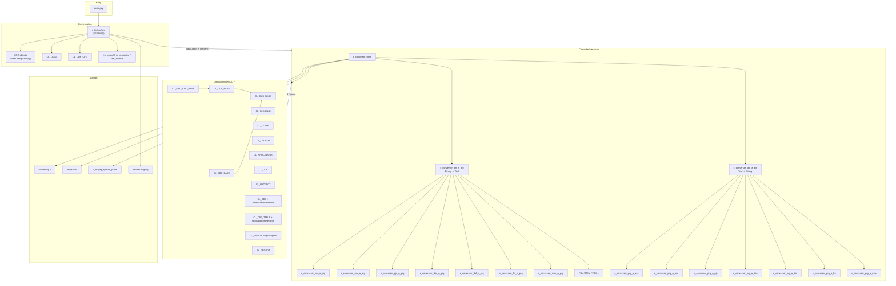
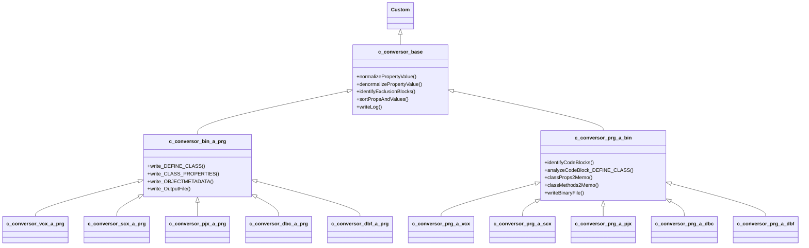
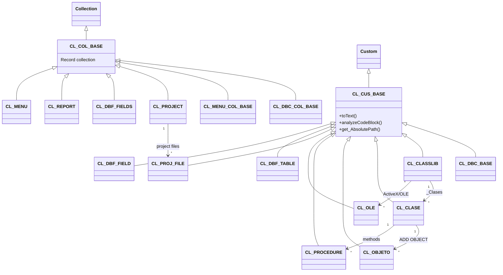
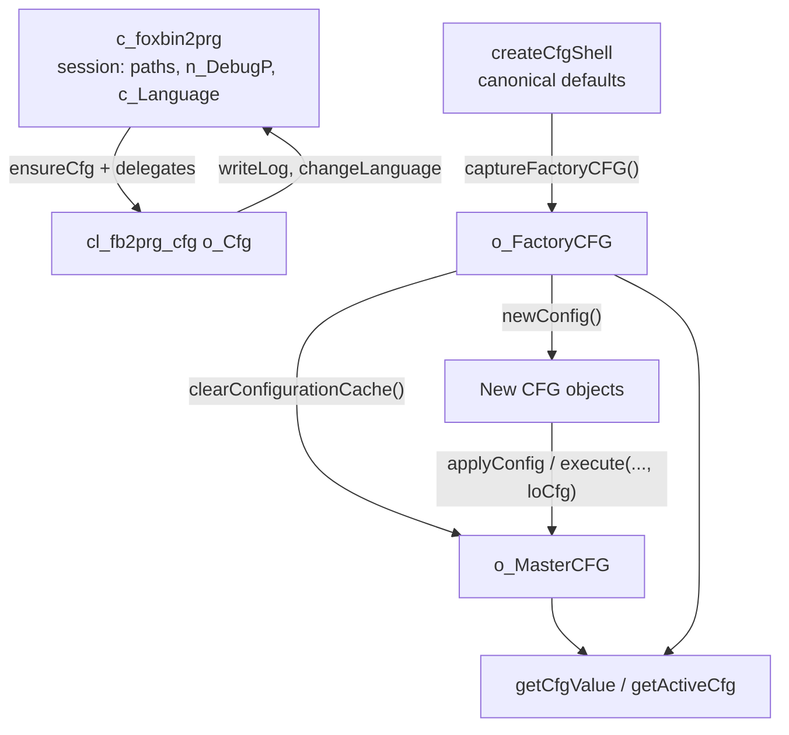
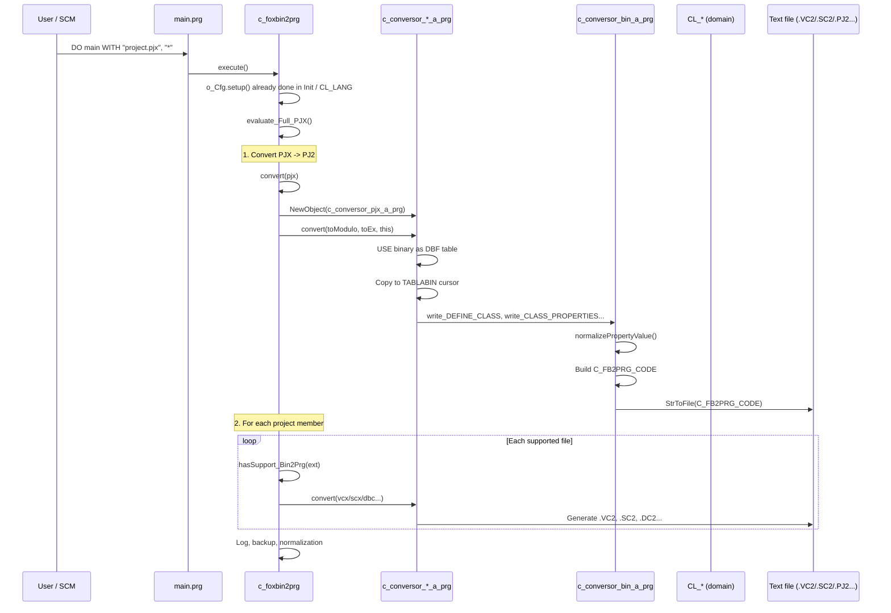
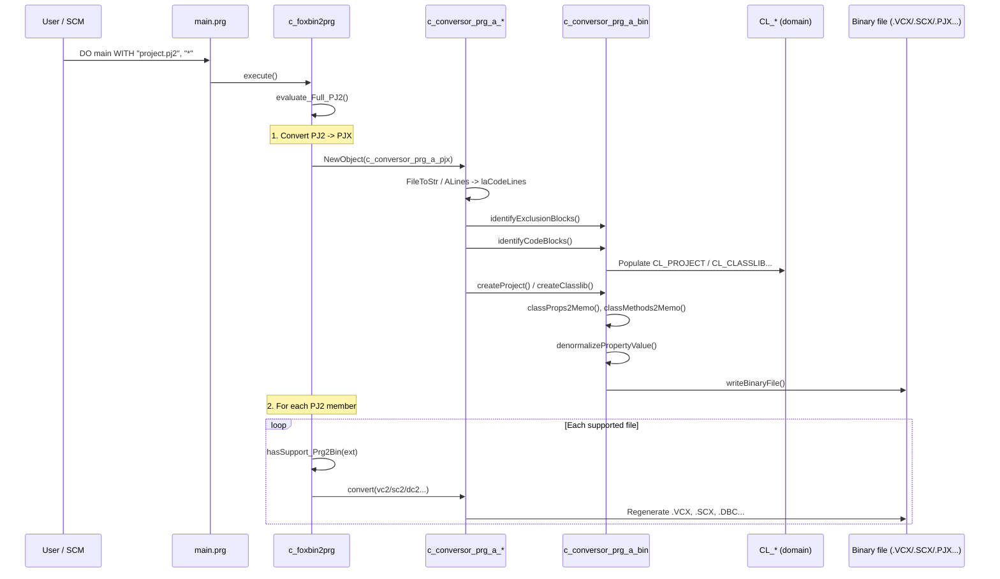
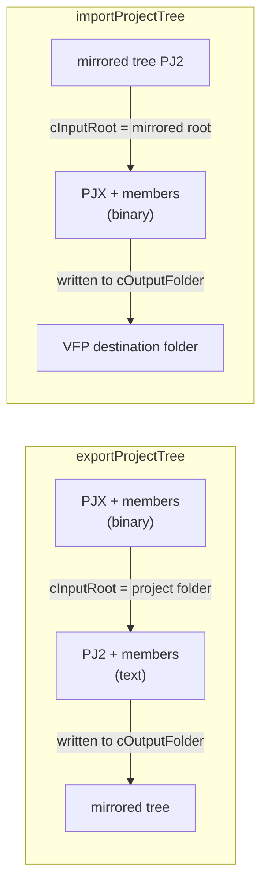

# FoxBin2Prg Architecture

**FoxBin2Prg** is a Visual FoxPro 9 tool that converts VFP binary artifacts (VCX, SCX, PJX, DBC, DBF, FRX, MNX, etc.) into hybrid text files (VC2, SC2, PJ2, DC2, ...) suitable for version control and merge, and converts those text files back into binaries.

The text format is **not executable code** — it is a structured PRG with `DEFINE CLASS` blocks, XML metadata tags, and base64 OLE blobs.

---

## Overall architecture diagram



---

## Converter class hierarchy



---

## Domain model hierarchy



---

## Classes by layer

### Entry and orchestration layer

| Class | File | Purpose |
|--------|---------|------------|
| **main.prg** | `main.prg` | CLI entry point; receives parameters and instantiates `c_foxbin2prg` |
| **c_foxbin2prg** | `c_foxbin2prg.prg` | Central orchestrator: session, log, progress, extension routing, full-project conversion; delegates CFG to `o_Cfg` |
| **cl_fb2prg_cfg** | `cl_fb2prg_cfg.prg` | Configuration manager: `createCfgShell()` schema, `newConfig()` / `applyConfig()` / `lockMasterFromObject()`, `o_FactoryCFG` / `o_MasterCFG` |
| **cl_file_utils** | `cl_file_utils.prg` | Win32/path helpers (`o_FileUtils` on the host) |
| **cl_fb2prg_mirror** | `cl_fb2prg_mirror.prg` | Mirrored project tree (`o_Mirror` on the host) |
| **CL_LANG** | `cl_lang.prg` | Localized strings (EN/ES/FR/DE) for UI and log |
| **CL_DBF_CFG** | `cl_dbf_cfg.prg` | Per-DBF-table configuration |
| **frm_main** | `frm_main.prg` | Help/about form |
| **frm_interactive** | `frm_interactive.prg` | UI to choose bin<->text direction |
| **frm_avance** | `frm_avance.prg` | Progress bar |
| **cl_fb2prg_special_props** | `cl_fb2prg_special_props.prg` | Property sort order by control type (`props/*.txt`); instantiated as `o_SpecialProps` and passed to converters |

### Conversion layer (pipeline)

| Class | Purpose |
|--------|------------|
| **c_conversor_base** | Shared logic: property normalization, XML encoding, comment parsing, prop sort order (`props/*.txt`), tags from `foxbin2prg.h` |
| **c_conversor_bin_a_prg** | **Binary->text** base: reads binary DBF tables, builds `C_FB2PRG_CODE`, writes with `StrToFile` |
| **c_conversor_prg_a_bin** | **Text->binary** base: reads hybrid PRG lines, identifies code blocks, rebuilds domain objects, writes binary |
| **c_conversor_*_a_prg** | Per-type exporters: VCX->VC2, SCX->SC2, PJX->PJ2, DBC->DC2, DBF->DB2, FRX->FR2, MNX->MN2, etc. |
| **c_conversor_prg_a_*** | Reverse importers: VC2->VCX, SC2->SCX, PJ2->PJX, etc. |

#### Binary -> text converters

| Class | File | Conversion |
|--------|---------|-----------|
| `c_conversor_vcx_a_prg` | `c_conversor_vcx_a_prg.prg` | VCX -> VC2 |
| `c_conversor_scx_a_prg` | `c_conversor_scx_a_prg.prg` | SCX -> SC2 |
| `c_conversor_pjx_a_prg` | `c_conversor_pjx_a_prg.prg` | PJX -> PJ2 |
| `c_conversor_pjm_a_prg` | `c_conversor_pjm_a_prg.prg` | PJM -> PJ2 |
| `c_conversor_frx_a_prg` | `c_conversor_frx_a_prg.prg` | FRX/LBX -> FR2/LB2 |
| `c_conversor_mnx_a_prg` | `c_conversor_mnx_a_prg.prg` | MNX -> MN2 |
| `c_conversor_dbc_a_prg` | `c_conversor_dbc_a_prg.prg` | DBC -> DC2 |
| `c_conversor_dbf_a_prg` | `c_conversor_dbf_a_prg.prg` | DBF -> DB2 |
| `c_conversor_fky_a_prg` | `c_conversor_fky_a_prg.prg` | FKY -> FK2 |
| `c_conversor_mem_a_prg` | `c_conversor_mem_a_prg.prg` | MEM -> ME2 |

#### Text -> binary converters

| Class | File | Conversion |
|--------|---------|-----------|
| `c_conversor_prg_a_vcx` | `c_conversor_prg_a_vcx.prg` | VC2 -> VCX |
| `c_conversor_prg_a_scx` | `c_conversor_prg_a_scx.prg` | SC2 -> SCX |
| `c_conversor_prg_a_pjx` | `c_conversor_prg_a_pjx.prg` | PJ2 -> PJX |
| `c_conversor_prg_a_frx` | `c_conversor_prg_a_frx.prg` | FR2/LB2 -> FRX/LBX |
| `c_conversor_prg_a_mnx` | `c_conversor_prg_a_mnx.prg` | MN2 -> MNX |
| `c_conversor_prg_a_dbc` | `c_conversor_prg_a_dbc.prg` | DC2 -> DBC |
| `c_conversor_prg_a_dbf` | `c_conversor_prg_a_dbf.prg` | DB2 -> DBF |

**Note:** FKY and MEM have converters only in the binary->text direction (`c_conversor_fky_a_prg`, `c_conversor_mem_a_prg`). Text->binary import (`c_conversor_prg_a_fky`, `c_conversor_prg_a_mem`) is not active in `c_foxbin2prg.convert()` routing.

### Domain model - base classes

| Class | File | Purpose |
|--------|---------|------------|
| **CL_CUS_BASE** | `cl_cus_base.prg` | Base for a single record/object: `toText()`, code-block analysis, path helpers |
| **CL_COL_BASE** | `cl_col_base.prg` | Base for record collections |
| **CL_DBC_BASE** | `cl_dbc_base.prg` | Base for a single DBC metadata record |
| **CL_DBC_COL_BASE** | `cl_dbc_col_base.prg` | Base for DBC metadata collections |
| **CL_MENU_COL_BASE** | `cl_menu_col_base.prg` | Base for menu collections |

### Domain model - VCX/SCX (forms and class libraries)

| Class | File | Purpose |
|--------|---------|------------|
| **CL_CLASSLIB** | `cl_classlib.prg` | Container for a VCX/SCX: classes, OLE, external classes |
| **CL_CLASE** | `cl_clase.prg` | A class definition: properties, methods, RESERVED |
| **CL_OBJETO** | `cl_objeto.prg` | An embedded object (`ADD OBJECT`) |
| **CL_PROCEDURE** | `cl_procedure.prg` | A method/procedure |
| **CL_OLE** | `cl_ole.prg` | OLE/ActiveX definition (base64 blob in text) |

### Domain model - Project

| Class | File | Purpose |
|--------|---------|------------|
| **CL_PROJECT** | `cl_project.prg` | Project header metadata (PJ2) |
| **CL_PROJ_FILE** | `cl_proj_file.prg` | A project file entry |
| **CL_PROJ_SRV_HEAD** | `cl_proj_srv_head.prg` | Server header section |
| **CL_PROJ_SRV_DATA** | `cl_proj_srv_data.prg` | Server data section |

### Domain model - DBC (database container)

| Class | File | Purpose |
|--------|---------|------------|
| **CL_DBC** | `cl_dbc.prg` | DBC root record |
| **CL_DBC_CONNECTION** / **CL_DBC_CONNECTIONS** | `cl_dbc_connection.prg`, `cl_dbc_connections.prg` | Connections |
| **CL_DBC_TABLE** / **CL_DBC_TABLES** | `cl_dbc_table.prg`, `cl_dbc_tables.prg` | Tables |
| **CL_DBC_FIELD_DB** / **CL_DBC_FIELDS_DB** | `cl_dbc_field_db.prg`, `cl_dbc_fields_db.prg` | Table fields |
| **CL_DBC_INDEX_DB** / **CL_DBC_INDEXES_DB** | `cl_dbc_index_db.prg`, `cl_dbc_indexes_db.prg` | Table indexes |
| **CL_DBC_VIEW** / **CL_DBC_VIEWS** | `cl_dbc_view.prg`, `cl_dbc_views.prg` | Views |
| **CL_DBC_FIELD_VW** / **CL_DBC_FIELDS_VW** | `cl_dbc_field_vw.prg`, `cl_dbc_fields_vw.prg` | View fields |
| **CL_DBC_INDEX_VW** / **CL_DBC_INDEXES_VW** | `cl_dbc_index_vw.prg`, `cl_dbc_indexes_vw.prg` | View indexes |
| **CL_DBC_RELATION** / **CL_DBC_RELATIONS** | `cl_dbc_relation.prg`, `cl_dbc_relations.prg` | Relations |

### Domain model - DBF, Reports, Menus, Macros

| Group | Classes | Purpose |
|-------|---------|------------|
| **DBF** | `CL_DBF_TABLE`, `CL_DBF_FIELD(S)`, `CL_DBF_INDEX(ES)`, `CL_DBF_RECORD(S)` | DBF table structure and data |
| **Reports** | `CL_REPORT` | Report/label model (FRX/LBX) |
| **Menus** | `CL_MENU`, `CL_MENU_BARPOP`, `CL_MENU_OPTION` | Menu structure |
| **Macros/Memvars** | `CL_MACRO`, `CL_MACRO_RECORD`, `CL_MEMVAR`, `CL_MEMVAR_RECORD` | FKY and MEM files |
| **DBF utilities** | `CL_DBF_UTILS`, `CL_DBF_UTILS_FIELD` | DBF manipulation helpers |

### Binary <-> text mapping (default)

| Binary | Text |
|---------|-------|
| VCX | VC2 |
| SCX | SC2 |
| PJX / PJM | PJ2 |
| FRX | FR2 |
| LBX | LB2 |
| DBC | DC2 |
| DBF | DB2 |
| MNX | MN2 |
| FKY | FK2 |
| MEM | ME2 |

Extensions are configurable via a CFG object (e.g. `loCfg.c_VC2 = 'VCA'` for SourceSafe). FKY and MEM: export only (see note above).

---


### Configuration model (`cl_fb2prg_cfg` via `o_Cfg`)

Configuration is **object-only**: no `foxbin2prg.cfg` on disk and no per-directory inheritance. Use `newConfig()`, assign properties, then pass the object to `execute`, `exportProjectTree`, `importProjectTree`, or `applyConfig`.



| Role | Object / API | Description |
|-------|----------------|-----------|
| Factory defaults | `createCfgShell()` in `cl_fb2prg_cfg` | Canonical schema source (`n_Debug = 0`, `c_VC2 = 'VC2'`, …) |
| Factory snapshot | `o_FactoryCFG` | Cloned in `setup()` with `captureFactoryCFG()`; **immutable** at runtime; base for `newConfig()` and reset |
| Master CFG | `o_MasterCFG` | Effective session CFG: factory defaults after `setup()`, or copy from `applyConfig` / `execute(..., loCfg)` |
| Resolution | `getActiveCfg()`, `getCfgValue('prop')` | Reads from `o_MasterCFG`; `n_DebugP` on the host overrides `n_Debug` when set |
| Programmatic use | `newConfig()` + props + `applyConfig()` / `execute(..., loCfg)` / `exportProjectTree(..., loCfg)` | Copies into `o_MasterCFG` via `lockMasterFromObject` |
| Factory clone (API) | `get_DirSettings(tcDir)` | Returns a **factory-default** CFG clone (`newConfig()`); does not read disk |
| Reference | `formatConfigReferenceText()` | Help text for `frm_main`; `DO main.prg` with no file shows the reference form |

**Typical flow**

| Step | API | Result |
|------|-----|--------|
| Init | `o_Cfg.setup()` | `o_FactoryCFG` captured; `o_MasterCFG` = factory clone |
| Optional session override | `applyConfig(loCfg)` | `loCfg` copied into `o_MasterCFG`; `n_CFG_EvaluateFromParam = 1` |
| Run conversion | `execute(path, type, loCfg)` | If `loCfg` passed, locks master CFG before processing |
| Reset to defaults | `clearConfigurationCache()` | Restores `o_MasterCFG` from `o_FactoryCFG` |

**Removed (legacy):** `evaluateConfiguration()` and on-disk `foxbin2prg.cfg` inheritance. Property names in older docs map to the same fields on the CFG object (see `getConfigPropertyCatalog()` in `cl_fb2prg_cfg.prg`).

Special cases: `n_DebugP` on the host session overrides CFG; `c_Language` is global on the session.

---

## Flow: FoxPro (binary) -> Text (BIN2PRG)



### Step by step (single file, e.g. VCX -> VC2)

1. **`main.prg`** creates `c_foxbin2prg` and calls `execute()`.
2. **`c_foxbin2prg.convert()`** detects the `.VCX` extension and instantiates `c_conversor_vcx_a_prg`.
3. **`c_conversor_vcx_a_prg.convert()`**:
   - Opens the VCX as a DBF table (`USE ... SHARED`)
   - Copies records to the `TABLABIN` cursor
   - Iterates classes (`PLATFORM='WINDOWS'`, `RESERVED1='Class'`)
   - For each class: extracts properties from the `PROPERTIES` memo, methods from `METHODS`, child objects
   - Writes blocks via `write_DEFINE_CLASS`, `write_CLASS_PROPERTIES`, `write_OBJECTMETADATA`, OLE as `*< OLE: ... />`
4. **`c_conversor_base`** normalizes special values (`_memberdata`, CR/LF codes, XML).
5. **`c_conversor_bin_a_prg.write_OutputFile()`** writes `C_FB2PRG_CODE` to the `.VC2` file.
6. **`c_foxbin2prg`** logs, optional backup, and capitalization normalization.

### Full project (PJX -> PJ2 + members)

In `c_foxbin2prg.evaluate_Full_PJX()`:

1. Opens the PJX and collects all referenced files (except header types like `H`).
2. Converts the PJX to PJ2 first.
3. For each member with a supported extension (`hasSupport_Bin2Prg`), calls `convert()` individually.

### Entry modes

```foxpro
DO main.prg WITH "<path>\FILE.VCX"       && Generates FILE.VC2
DO main.prg WITH "<path>\FILE.PJX", "*"  && Converts full project
DO main.prg WITH "<dir>", "BIN2PRG"      && All supported binaries in folder
```

---

## Flow: Text -> FoxPro binary (PRG2BIN)



### Step by step (single file, e.g. VC2 -> VCX)

1. **`c_foxbin2prg.convert()`** instantiates `c_conversor_prg_a_vcx` for `.VC2`.
2. **`c_conversor_prg_a_vcx.convert()`**:
   - Reads the file with `FileToStr` and splits into lines (`ALines`)
   - Creates `CL_CLASSLIB` as an in-memory model
   - `identifyExclusionBlocks()` — skips TEXT/ENDTEXT, `#IF`, etc. blocks
   - `identifyCodeBlocks()` — parses `DEFINE CLASS`, `ADD OBJECT`, `PROCEDURE`, metadata tags
   - `analyzeCodeBlock_*` — fills `CL_CLASE`, `CL_OBJETO`, `CL_PROCEDURE`
3. **`c_conversor_prg_a_bin`**:
   - `createClasslib()` — creates/opens VCX table structure
   - `classProps2Memo()` — serializes properties back to the `PROPERTIES` memo
   - `classMethods2Memo()` / `objectMethods2Memo()` — rebuilds method memos
   - `denormalizePropertyValue()` — reverses export normalizations
4. **`writeBinaryFile()`** — writes records to the VCX and memos to the VCT.
5. **`c_foxbin2prg`** — backup, log, optional recompile.

### Full project (PJ2 -> PJX + members)

In `c_foxbin2prg.evaluate_Full_PJ2()`:

1. Extracts the file list from the `*<BuildProj>...*</BuildProj>` block in the PJ2.
2. Converts PJ2 -> PJX first.
3. For each member with a supported extension (`hasSupport_Prg2Bin`), calls `convert()` in the reverse direction.

### Entry modes

```foxpro
DO main.prg WITH "<path>\FILE.VC2"       && Generates FILE.VCX
DO main.prg WITH "<path>\FILE.PJ2", "*"  && Reconverts full project
DO main.prg WITH "<dir>", "PRG2BIN"      && All supported text files in folder
```

---

## Mirrored tree

The `cl_fb2prg_mirror` class (instantiated as `c_foxbin2prg.o_Mirror`) replicates the project's subfolder structure when converting files. Session properties `cInputRoot` (source root) and `cOutputFolder` (destination root) control path mapping in both directions.

### High-level API

| Method | Input | Output | Direction |
|--------|---------|---------|---------|
| `exportProjectTree` | `.PJX` (binary) | mirrored folder | Bin -> Txt |
| `importProjectTree` | `.PJ2` (text) | VFP project folder | Txt -> Bin |

Signatures (both on `c_foxbin2prg`):

```foxpro
lnResp = loFb2p.exportProjectTree( tcProjectFile, tcOutputRoot [, toCfg] [, tcInputRoot] )
lnResp = loFb2p.importProjectTree( tcMirrorProjectFile, tcOutputRoot [, toCfg] [, tcInputRoot] )
```

| Parameter | Export | Import |
|-----------|--------|--------|
| Project file | `tcProjectFile` — `.PJX` in the project folder | `tcMirrorProjectFile` — `.PJ2` in the mirrored tree (or `c_PJ2` CFG value) |
| Destination root | `tcOutputRoot` — folder where text files are written | `tcOutputRoot` — folder where binaries are regenerated |
| Configuration | `toCfg` — CFG object (`newConfig()` / `isCfg`) or duck-typed object (`configFromObject`) | same |
| Source root | `tcInputRoot` — project folder (default: PJX folder) | `tcInputRoot` — mirrored tree root (default: PJ2 folder) |

Internally, both methods call `o_Mirror.setProjectRoots(tcOutputRoot, tcInputRoot)` and `execute(..., '*')`, which routes to `evaluate_Full_PJX` (export) or `evaluate_Full_PJ2` (import).

### Path mapping



- **Export (Bin->Txt):** `get_MirroredPath` remaps each source file to the mirrored path under `cOutputFolder`.
- **Import (Txt->Bin):** `get_MirroredOutputFile` (in `c_conversor_base`) remaps the binary destination to `cOutputFolder`, preserving subfolders relative to `cInputRoot`.

### Round-trip flow (export -> SCM -> import)

```foxpro
loFb2p = NewObject('c_foxbin2prg', 'c_foxbin2prg.prg')
loCfg  = loFb2p.newConfig()
loCfg.l_NoTimestamps       = .T.
loCfg.l_CopyNonConvertible = .T.
loCfg.c_ExcludedSubdirs    = 'tmp;backup'

* 1) Export binary project to mirrored tree
loFb2p.exportProjectTree('d:\src\app\app.pjx', 'd:\export\app', loCfg)

* 2) Edit text files in SCM (VC2, SC2, PJ2, ...)

* 3) Import back to the VFP project folder
loFb2p.importProjectTree('d:\export\app\app.pj2', 'd:\src\app', loCfg)
```

### Mirrored tree options

Used **only** with `exportProjectTree` / `importProjectTree` (when `cOutputFolder` is set). Full user guide: **[EXPORT_IMPORT_MIRROR.md](EXPORT_IMPORT_MIRROR.md)**.

| `.cfg` key | Property | Default | Summary |
|--------------|-------------|--------|-------------------|
| `ExcludedSubdirs` | `c_ExcludedSubdirs` | *(empty)* | Subfolders ignored (not converted or copied) |
| `CopyNonConvertible` | `l_CopyNonConvertible` | `0` | Copies non-convertible members to the mirror |
| `CopyExcludedPjxFiles` | `l_CopyExcludedPjxFiles` | `0` | Includes members with **Exclude** flag in PJX/PJ2 |

Other useful round-trip options: `l_Recompile`, `l_NoTimestamps`, `l_CopyLowercaseNames`.

Full export/import example: [`create_mirrored.prg`](../create_mirrored.prg).

---

## Pipeline overview

```mermaid
flowchart LR
    subgraph bin2prg["BIN2PRG (export)"]
        B1["Binary file<br/>VCX/SCX/PJX/DBC..."]
        B2["USE as DBF<br/>TABLABIN cursor"]
        B3["Converter *_a_prg<br/>write_* methods"]
        B4["C_FB2PRG_CODE<br/>hybrid PRG"]
        B5["Text file<br/>VC2/SC2/PJ2..."]
        B1 --> B2 --> B3 --> B4 --> B5
    end

    subgraph prg2bin["PRG2BIN (import)"]
        P1["Text file<br/>VC2/SC2/PJ2..."]
        P2["FileToStr + ALines"]
        P3["identifyCodeBlocks<br/>CL_* in memory"]
        P4["classProps2Memo<br/>writeBinaryFile"]
        P5["Binary file<br/>VCX/SCX/PJX/DBC..."]
        P1 --> P2 --> P3 --> P4 --> P5
    end

    B5 -.->|"merge in Git/CVS"| P1
```



---

## Support files

| File | Purpose |
|---------|--------|
| `foxbin2prg.h` | Constants and metadata tags (`C_LIBCOMMENT_I`, `C_CLASSMETADATA_I`, etc.) |
| `props/*.txt` | Property sort order by control type (loaded by `cl_fb2prg_special_props`) |
| `FoxBin2Prg.cfg` | Custom extensions, behavior flags |
| `tools/extract_classes.py` | Tool that extracted classes from the original FoxBin2Prg monolith |
| `tools/class_map.txt` | Map of extracted classes |
| `tools/convert_to_cp1252.py` | Converts `.prg`/`.cfg` to CP1252+CRLF after editing |
| `tools/verify_cp1252.py` | Encoding validation for `.prg` |
| `tools/verify_utf8_docs.py` | Encoding validation for `.md` documentation |

---

## Repository structure

There are no `src/` or `lib/` folders. Each class lives in a `.prg` file at the project root, refactored from the original FoxBin2Prg monolith (history in `tools/extract_classes.py` and `tools/class_map.txt`). The `foxbin2prg.prg` monolith is no longer part of the repository.

```
fox2/
|-- main.prg                    # CLI entry
|-- c_foxbin2prg.prg            # Orchestrator
|-- cl_fb2prg_cfg.prg           # Configuration manager
|-- cl_file_utils.prg           # Win32/path helpers
|-- cl_fb2prg_mirror.prg        # Mirrored tree
|-- cl_fb2prg_special_props.prg # Property sort order
|-- c_conversor_*.prg           # Conversion pipeline
|-- cl_*.prg                    # Domain model
|-- frm_*.prg                   # UI forms
|-- create_mirrored.prg         # Mirrored export/import example
|-- create_foxbin2prg.prg       # Executable build
|-- foxbin2prg.h                # Constants
|-- props/                      # Property sort data
|-- tools/                      # Maintenance and encoding scripts
|-- docs/
    |-- arquitetura.md          # This document (English)
    |-- EXPORT_IMPORT_MIRROR.md # Mirrored tree guide (English)
```
