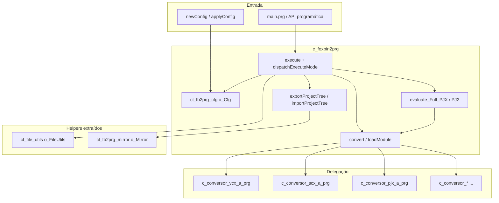
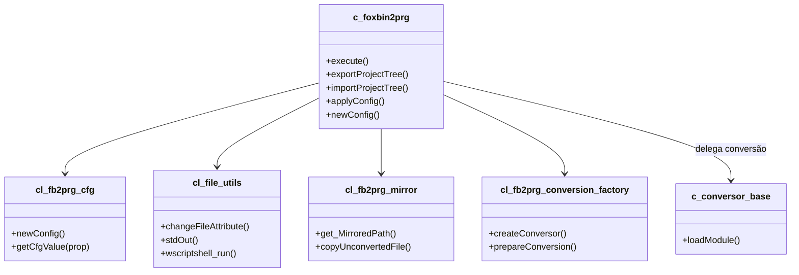

# Documentação: classe `c_foxbin2prg`

> Análise estrutural da classe orquestradora do FoxBin2Prg (Visual FoxPro 9).  
> Arquivo fonte modular: `c_foxbin2prg.prg` (~3.980 linhas, ~100 métodos).  
> Data da análise: 2026-06-29 (atualização pós-modularização e extração de helpers)

---

## Visão geral

A classe **`c_foxbin2prg`** herda de **`Session`** e funciona como **orquestrador central** do FoxBin2Prg. Ela não faz a conversão binário↔texto em si; delega isso às classes `c_conversor_*` nos módulos `c_conversor_*.prg` listados em `unify.txt`. O monólito `foxbin2prg.prg` é gerado por `unify.prg` a partir desses fontes.



**Resumo numérico:** ~100 métodos públicos/protegidos, ~45 propriedades de sessão no host (opções de conversão residem no objeto CFG via `getCfgValue()`), 4 membros `Protected` na área `execute`, 2 `Hidden`.

---

## Estrutura de propriedades (por categoria)

### Identidade e versão

| Propriedade | Finalidade |
|---|---|
| `n_FB2PRG_Version`, `c_FB2PRG_Version_Real`, `c_FB2PRG_EXE_Version` | Versão interna e exibida |
| `c_Foxbin2prg_FullPath`, `c_Foxbin2prg_ConfigFile` | Caminho do executável/PRG e CFG principal |
| `c_CurDir`, `c_TempDir` | Diretório atual e temporário |
| `c_Language`, `c_Language_In` | Idioma das mensagens (EN/ES/FR/DE) |

### Entrada/saída da conversão

| Propriedade | Finalidade |
|---|---|
| `c_InputFile`, `c_OutputFile`, `c_OriginalFileName` | Arquivos em processamento |
| `c_ClassToConvert`, `c_ClassOperationType` | Classe individual (`arquivo.vcx::classe`) e Import/Export |
| `c_Type`, `c_Recompile`, `l_Recompile` | Tipo de saída e recompilação |
| `cOutputFolder`, `n_HomeDir` | Pasta de destino e gravação de HomeDir no PJ2 |
| `t_InputFile_TimeStamp`, `t_OutputFile_TimeStamp` | Timestamps para otimização |

### Estado de erro e log

| Propriedade | Finalidade |
|---|---|
| `l_Error`, `l_Errors`, `c_TextErr` | Erros da execução atual e acumulados |
| `c_LogFile`, `c_ErrorLogFile`, `c_TextLog` | Arquivos e buffer de log |
| `l_ShowErrors`, `n_Debug`, `n_DebugP` | Exibição de erros e debug |
| `l_StdOutHabilitado` | Saída para stdout/stderr (modo EXE) |

### Configuração (objeto CFG via `o_Cfg`)

| Propriedade / API | Finalidade |
|---|---|
| `o_Cfg` (`cl_fb2prg_cfg`) | Gerenciador: `o_CFG`, `newConfig()`, `applyConfig()`, `getCfgValue()` |
| `getCfgValue` / `setCfgValue` / `getCfgFlag` / `getCfgInt` | Leitura/escrita na CFG de sessão |
| `n_DebugP` | Override de CLI para `n_Debug` (prioridade sobre CFG) |

> **Nota (2026):** `foxbin2prg.cfg` em disco, `o_Configuration` (Collection), `evaluateConfiguration()` e os ~38 métodos `_ACCESS` foram removidos. Propriedades como `c_VC2`, `l_NoTimestamps`, `n_UseClassPerFile`, `l_CopyNonConvertible`, `l_ExportUTF8`, etc. existem apenas no objeto CFG retornado por `newConfig()` — consulte `getConfigPropertyCatalog()` em `cl_fb2prg_cfg.prg`.

### Extensões e suporte (via CFG)

Resolvidas em tempo de execução com `getCfgValue('c_VC2')`, `hasSupport_Bin2Prg()`, `get_Ext2FromExt()`, etc. O host não declara mais dezenas de propriedades `c_*2` / `n_*_Conversion_Support` duplicadas.

### Espelhamento (mirror)

| Propriedade | Finalidade |
|---|---|
| `cOutputFolder` | Pasta de destino na árvore espelhada |
| `cInputRoot` | Raiz do projeto/fonte espelhado |
| `l_MirrorExport` | `.T.` durante `evaluate_Full_PJX` |
| `o_Mirror` | Instância de `cl_fb2prg_mirror` (path mapping, cópia de não-convertíveis) |

### Class-per-file / Form-per-file / DBC split (via CFG)

Propriedades `n_UseClassPerFile`, `l_UseClassPerDir`, `n_UseFormPerFile`, `n_UseFilesPerDBC`, etc. — ver catálogo em `cl_fb2prg_cfg.prg`. Helpers no host: `getPerFileDir`, `getPerFileOutputPath`, `resolvePj2TextMemberPath`.

### Comportamento de conversão (via CFG)

`l_NoTimestamps`, `l_Recompile`, `n_OptimizeByFilestamp`, opções DBF/DBC, ordenação de métodos/props — todas via `getCfgValue()`. O host mantém apenas flags de teste unitário (`l_MethodSort_Enabled`, `l_PropSort_Enabled`, `l_ReportSort_Enabled`).

### Objetos auxiliares

| Propriedade | Finalidade |
|---|---|
| `o_FSO`, `o_WSH`, `o_TextStream` | FileSystemObject, WScript.Shell |
| `o_FileUtils` | `cl_file_utils` — Win32, paths, stdout, `wscriptshell_run` |
| `o_Mirror` | `cl_fb2prg_mirror` — árvore espelhada |
| `o_Cfg` | `cl_fb2prg_cfg` — configuração |
| `o_SpecialProps` | `cl_fb2prg_special_props` — ordem de propriedades |
| `o_ConversionFactory` | `cl_fb2prg_conversion_factory` — roteamento extensão → `c_conversor_*` |
| `run_AfterCreateTable`, `run_AfterCreate_DB2` | Hooks pós-criação DBF/DB2 |

---

## Métodos por categoria

### 1. Ciclo de vida

| Método | Linhas ~ | Finalidade |
|---|---|---|
| **`Init`** | 175–280 | Ambiente VFP, DLLs, logs, idioma, `o_FSO`, `ensureCfg()` / `ensureSpecialProps()` |
| **`Destroy`** | 281–328 | Flush de logs, libera forms/objetos, `o_FileUtils.clearDll()` |

### 2. Ponto de entrada principal (`execute` refatorado)

| Método | Linhas ~ | Finalidade |
|---|---|---|
| **`execute`** | 1726–1814 (~90) | API pública: valida ambiente, monta contexto, despacha modo |
| **`dispatchExecuteMode`** | 1600–1639 | `DO CASE` central: arquivo único, diretório, PJX/PJ2, wildcard, UI vazia |
| **`resolveExecuteMode`** | 1311–1356 | Determina modo a partir de extensão e `tcType` |
| **`buildExecuteContext`** | 1294–1309 | Objeto `loCtx` com flags bin/text e CFG efetiva |
| **`mergeExecuteConfig`** | 1115–1129 | Mescla `toCfg` na sessão antes da conversão |
| **`beginExecuteSession`** / **`finalizeExecuteSession`** | 1131–1723 | Setup/teardown de ESC, notify, log, progress bar |
| **`executeSingleFile`** / **`executeDirectoryBatch`** / **`executeSingleProject`** | 1547–1584 | Handlers por modo |
| **`executeBin3Prg`** / **`executePrg3Bin`** | 1434–1468 | Aliases internos → `exportProjectTree` / `importProjectTree` |

### 3. Espelhamento de projeto

| Método | Finalidade |
|---|---|
| **`exportProjectTree`** | PJX → árvore espelhada em texto (`execute` com `*`) |
| **`importProjectTree`** | PJ2 → regenera binários na pasta destino |
| Wrappers | `get_MirroredPath`, `isExcludedSubdir`, `copyUnconvertedFile`, `makeDirTree` → delegam a `o_Mirror` |

### 4. Codificação UTF-8 (export/import)

| Método | Finalidade |
|---|---|
| **`isExportUTF8`** | Lê `l_ExportUTF8` da CFG |
| **`encodeTextForExport`** / **`decodeTextFromImport`** | `StrConv` ANSI ↔ UTF-8 |
| **`readTextFile`** / **`writeTextFile`** | I/O de arquivos texto respeitando CFG |
| **`finalizeTextExportFile`** | Converte arquivo ANSI temporário para UTF-8 in-place |

### 5. Conversão de arquivos

| Método | Visibilidade | Finalidade |
|---|---|---|
| **`convert`** | Protected | Conversão completa (linhas ~2193–2758): factory `c_conversor_*`, backup, otimização, recompilação |
| **`loadModule`** | Public | Unit tests (~3438–3639): sem backup/recompilação |
| **`compileFoxProBinary`** | Public | `COMPILE CLASSLIB/FORM/REPORT/...` após regeneração |
| **`get_PROGRAM_HEADER`** | Public | Cabeçalho meta dos arquivos texto |

### 6. Processamento de projetos

| Método | Finalidade |
|---|---|
| **`evaluate_Full_PJX`** | Bin→Txt de todos os membros do PJX (~1817–1982) |
| **`evaluate_Full_PJ2`** | Txt→Bin a partir do bloco `BUILD PROJECT` no PJ2 (~1984–2159) |

### 7. Configuração (`cl_fb2prg_cfg` via `o_Cfg`)

| Método | Finalidade |
|---|---|
| **`applyConfig`** | Copia objeto CFG para `o_CFG` (`lockMasterFromObject`) |
| **`newConfig`** | Clone dos defaults de fábrica para uso programático |
| **`get_DirSettings`** | Retorna clone de fábrica (`newConfig()`); **não lê disco** |
| **`getCfgValue` / `setCfgValue`** | Leitura/escrita na CFG de sessão |
| **`writeLogDbfCfgSettings`** | Log das propriedades DBF da sessão (`c_DBF_*`, `n_DBF_Conversion_Support`) |
| **`formatConfigReferenceText`** | Texto de referência para `frm_main` |

Delegação: lógica em `cl_fb2prg_cfg.prg`; `c_foxbin2prg` expõe wrappers (`ensureCfg()` + `o_Cfg.*`). Helpers lazy: `ensureFileUtils()`, `ensureMirror()`, `ensureSpecialProps()`.

> **Removido:** `evaluateConfiguration()`, métodos `_ACCESS` para propriedades CFG, `frm_interactive`.

### 8. Suporte e detecção de tipos

| Método | Finalidade |
|---|---|
| **`hasSupport_Bin2Prg`** | Arquivo suporta binário→texto? |
| **`hasSupport_Prg2Bin`** | Arquivo suporta texto→binário? |
| **`conversionSupportType`** | Retorna nível numérico de suporte (modo VSS) |
| **`get_Ext2FromExt`** | Mapeia VCX→VC2, PJX→PJ2, etc. |
| **`filenameFoundInFilter`** | Filtro wildcard para inclusão/exclusão |
| **`get_TextExtForBinFile`** / **`resolvePj2TextMemberPath`** | Extensão texto e path de membro PJ2 (class-per-file) |

### 9. Sistema de arquivos e backup

| Método | Finalidade |
|---|---|
| **`changeFileAttribute`** / **`changeFileTime`** | Delegam a `o_FileUtils` |
| **`doBackup`** | Backup em cascata (.BAK, .01.BAK, …) — permanece no host |
| **`comparedFilesAreEqual`** | Delega a `o_FileUtils` |
| **`renameFile`** | Capitalização via `filename_caps` |
| **`renameTmpFile2Tx2File`** | Delega a `o_FileUtils` |
| **`get_FilesFromDirectory`** | Varredura recursiva |
| **`get_AbsolutePath`** | Delega a `o_FileUtils` |

### 10. Rastreamento de arquivos processados

| Método | Finalidade |
|---|---|
| **`addProcessedFile`** | Registra arquivo no array `a_ProcessedFiles(6 cols)` |
| **`wasProcessed`** | Verifica se já foi processado (evita reprocesso) |
| **`updateProcessedFile`** | Atualiza flags P/E/S/X do registro |
| **`clearProcessedFiles`** | Limpa estatísticas entre execuções |
| **`get_Processed`** | Exporta array filtrado por máscara (API) |

### 11. Logging e saída console

| Método | Finalidade |
|---|---|
| **`writeLog`** / **`writeErrorLog`** (+ `_Flush`) | Log de debug/erros no host |
| **`stdOut`** / **`errOut`** | Delegam a `o_FileUtils` |
| **`doWriteErrorLog`** (Hidden) | Formata exceção e grava `.ERR` |
| **`exception2Str`** (Hidden) | Serializa objeto `Exception` |

### 12. UI e internacionalização

| Método | Finalidade |
|---|---|
| **`changeLanguage`** | Instancia `CL_LANG` em `_Screen` |
| **`loadProgressbarForm`** / **`unloadProgressbarForm`** | Form `frm_avance` |
| **`updateProgressbar`** | Proxy para barra de progresso; ESC → erro 1799 |
| **`getLocaleInfo`** | Idioma do SO via `GetLocaleInfoEx` |

### 13. Utilitários VFP / Windows

| Método | Finalidade |
|---|---|
| **`declareDLL`** | Delega a `o_FileUtils` |
| **`readInputVFPParams`** | Parse da linha de comando Windows (permanece no host) |
| **`wscriptshell_run`** | Wrapper → `o_FileUtils` |
| **`FERROR_Message`** / **`getLocaleInfo`** | Wrapper → `o_FileUtils` |

---

## Índice de métodos (referência rápida)

| Linha ~ | Método |
|---|---|
| 175 | `Init` |
| 281 | `Destroy` |
| 330 | `addProcessedFile` |
| 441–459 | `ensureFileUtils` / `ensureMirror` / `ensureCfg` / `ensureSpecialProps` |
| 1087–1661 | Métodos protegidos do pipeline `execute` |
| 1726 | `execute` |
| 1817 | `evaluate_Full_PJX` |
| 1984 | `evaluate_Full_PJ2` |
| 2193 | `convert` (Protected) |
| 2760–2846 | Wrappers CFG (`newConfig`, `applyConfig`, `getCfgValue`, …) |
| 2853 | `exportProjectTree` |
| 2875 | `importProjectTree` |
| 3092–3113 | Wrappers mirror (`get_MirroredPath`, `copyUnconvertedFile`, …) |
| 3438 | `loadModule` |
| 3711–3779 | UTF-8 (`isExportUTF8`, `readTextFile`, `writeTextFile`, …) |

> **Nota:** números de linha referem-se a `c_foxbin2prg.prg` modular (~3.980 linhas). Podem variar após edições.

---

## Problemas estruturais identificados

| Problema | Impacto | Estado |
|---|---|---|
| **`execute` monolítico (~1.170 linhas)** | Dificultava manutenção | **Mitigado** — refatorado em ~90 linhas + `dispatchExecuteMode` e handlers |
| **~38 métodos `_ACCESS` repetitivos** | Boilerplate de CFG | **Resolvido** — removidos; uso de `getCfgValue()` |
| **`wscriptshell_run` dentro da classe** | Responsabilidade OS misturada | **Parcial** — movido para `cl_file_utils` |
| **Duplicação `convert` ↔ `loadModule`** | Factory repetida | **Resolvido** — `cl_fb2prg_conversion_factory` + `convert(tcMode)` unificado |
| **I/O Win32 no orquestrador** | God Object | **Parcial** — `cl_file_utils` e `cl_fb2prg_mirror` extraídos |
| **`doBackup` / logging no host** | Classe ainda grande | **Pendente** — candidatos a extração |

---

## Sugestões de extração e reestruturação

### Concluído ou em progresso

| Item | Estado |
|---|---|
| **`cl_fb2prg_cfg`** — CFG object-only, sem `evaluateConfiguration` | Concluído |
| **`cl_file_utils`** — Win32, paths, stdout, `wscriptshell_run` | Concluído |
| **`cl_fb2prg_mirror`** — path mapping, subdirs excluídos, cópia | Concluído |
| **Refatorar `execute`** em métodos menores | Concluído (2026) |
| **Modularização** — fontes em `c_*.prg` / `cl_*.prg` + `unify.txt` | Concluído |

### Extrações recomendadas (prioridade restante)

#### 1. `cl_fb2prg_conversion_factory` (~150 linhas)

```foxpro
createConversor(tcExtension, tcInputFile)
prepareConversion(tcExtension, tcInputFile, tcBaseFile, tcForceAttribs)  && modo FULL
```

Substitui os dois `DO CASE` em `convert` e `loadModule`. **Concluído (2026).**

#### 2. `c_FB2P_Logger` (~200 linhas)

Extrair `writeLog*`, `writeErrorLog*`, `exception2Str`, `doWriteErrorLog` (stdout já em `cl_file_utils`).

#### 3. Unificar `convert` e `loadModule`

Parâmetro de modo:

```foxpro
convert(tcInput, toModulo, toEx, tlRelaunch, tcOriginal, tcMode)
* tcMode: 'FULL' | 'LOAD_ONLY'
```

`loadModule` delega a `convert(..., 'LOAD_ONLY')`. **Concluído (2026).**

#### 4. `doBackup` e rastreamento de processados

Candidatos a `c_FB2P_FileOps` / `c_FB2P_ProcessTracker` se a classe principal ainda crescer.

### Arquitetura atual (pós-modularização)



### Plano de migração incremental (baixo risco)

1. ~~**Próximo:** Factory de conversores + unificar `convert`/`loadModule`.~~ **Concluído (2026)** — `cl_fb2prg_conversion_factory.prg`
2. **Depois:** Extrair `c_FB2P_Logger`; mover `doBackup` para file ops.
3. **Opcional:** `c_FB2P_ProcessTracker` se testes exigirem isolamento.

### O que **não** extrair desta classe

As classes `c_conversor_*` e modelos `CL_*` já estão em módulos separados (`unify.txt`). A sobrecarga restante está no **orquestrador** (`convert`, logging, backup), não nos conversores.

---

## Conclusão

`c_foxbin2prg` concentra **orquestração**, **delegação de conversão**, **batch de projetos** e **API de espelhamento**. Desde 2025–2026 a classe encolheu (~6.000 → ~4.000 linhas) com:

1. CFG object-only em `cl_fb2prg_cfg` (sem `_ACCESS` nem `.cfg` em disco)
2. Helpers `cl_file_utils` e `cl_fb2prg_mirror`
3. `execute` refatorado com despacho por modo
4. Suporte UTF-8 (`l_ExportUTF8`) integrado ao pipeline texto

Próximo ganho: extrair `c_FB2P_Logger` e `doBackup`, mantendo a API pública (`execute`, `exportProjectTree`, `importProjectTree`, `applyConfig`, `newConfig`, `loadModule`) estável para SCM, Thor e testes.

---

## Documentos relacionados

- [arquitetura.md](arquitetura.md) — visão geral da arquitetura modular
- [export_import_mirror.md](export_import_mirror.md) — espelhamento de projetos
- [FoxBin2Prg_Internals.md](FoxBin2Prg_Internals.md) — opções de CFG e uso
- `unify.txt` — lista de módulos-fonte; `c_foxbin2prg.prg` é o orquestrador modular
