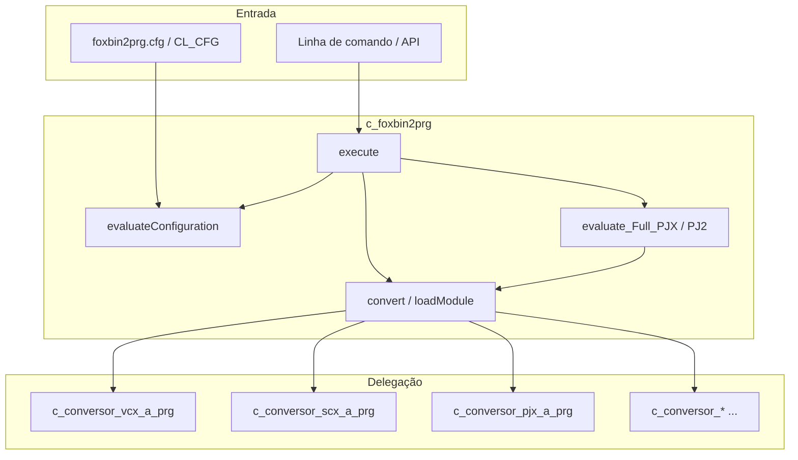
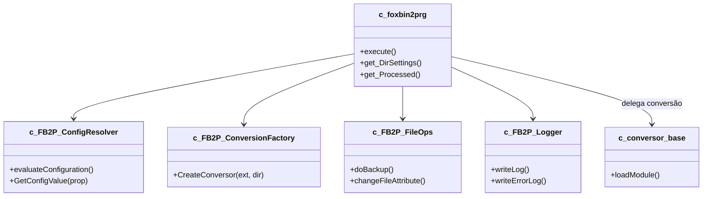

# Documentação: classe `c_foxbin2prg`

> Análise estrutural da classe orquestradora do FoxBin2Prg (Visual FoxPro 9).  
> Arquivo fonte: `c_foxbin2prg.PRG` (~5.950 linhas, ~99 métodos).  
> Data da análise: 2026-05-31

---

## Visão geral

A classe **`c_foxbin2prg`** herda de **`Session`** e funciona como **orquestrador central** do FoxBin2Prg. Ela não faz a conversão binário↔texto em si; delega isso às classes `c_conversor_*` definidas em `foxbin2prg.prg`.



**Resumo numérico:** ~99 métodos, ~140 propriedades, 4 membros `Protected`, 2 `Hidden`.

---

## Estrutura de propriedades (por categoria)

### Identidade e versão

| Propriedade | Finalidade |
|---|---|
| `n_FB2PRG_Version`, `c_FB2PRG_Version_Real`, `c_FB2PRG_EXE_Version` | Versão interna e exibida |
| `c_Foxbin2prg_FullPath`, `c_Foxbin2prg_ConfigFile` | Caminho do executável/PRG e CFG principal |
| `c_CurDir`, `c_TempDir` | Diretório atual e temporário |
| `c_Language`, `c_Language_In` | Idioma das mensagens (EN/ES/FR/DE) |

### Entrada/saída da conversão

| Propriedade | Finalidade |
|---|---|
| `c_InputFile`, `c_OutputFile`, `c_OriginalFileName` | Arquivos em processamento |
| `c_ClassToConvert`, `c_ClassOperationType` | Classe individual (`arquivo.vcx::classe`) e Import/Export |
| `c_Type`, `c_Recompile`, `l_Recompile` | Tipo de saída e recompilação |
| `cOutputFolder`, `n_HomeDir` | Pasta de destino e gravação de HomeDir no PJ2 |
| `t_InputFile_TimeStamp`, `t_OutputFile_TimeStamp` | Timestamps para otimização |

### Estado de erro e log

| Propriedade | Finalidade |
|---|---|
| `l_Error`, `l_Errors`, `c_TextErr` | Erros da execução atual e acumulados |
| `c_LogFile`, `c_ErrorLogFile`, `c_TextLog` | Arquivos e buffer de log |
| `l_ShowErrors`, `n_Debug`, `n_DebugP` | Exibição de erros e debug |
| `l_StdOutHabilitado` | Saída para stdout/stderr (modo EXE) |

### Configuração multi-diretório

| Propriedade | Finalidade |
|---|---|
| `o_Configuration` (Collection) | Cache de `CL_CFG` por diretório |
| `n_CFG_Actual`, `l_CFG_CachedAccess`, `l_Main_CFG_Loaded` | CFG ativa e cache |
| `n_CFG_EvaluateFromParam`, `l_SingleConfig`, `c_SingleConfig_Folder` | CFG manual / herança |
| `n_InhibitInheritance`, `l_AllowFolder` | Controle de herança de CFG |

### Extensões texto (TX2)

| Propriedade | Extensão binária |
|---|---|
| `c_PJ2`, `c_VC2`, `c_SC2`, `c_FR2`, `c_LB2` | PJX, VCX, SCX, FRX, LBX |
| `c_DB2`, `c_DC2`, `c_MN2`, `c_FK2`, `c_ME2` | DBF, DBC, MNX, FKY, MEM |
| `n_*_Conversion_Support` | Nível de suporte por tipo (0/1/2/4/8) |

### Class-per-file / Form-per-file / DBC split

| Propriedade | Finalidade |
|---|---|
| `n_UseClassPerFile`, `l_RedirectClassPerFileToMain`, `n_RedirectClassType`, `l_ClassPerFileCheck` | VCX dividido por classe |
| `n_UseFormPerFile`, `l_RedirectFormPerFileToMain`, `n_RedirectFormType`, `l_FormPerFileCheck` | SCX dividido por form |
| `n_UseFilesPerDBC`, `l_RedirectFilePerDBCToMain`, `l_ItemPerDBCCheck`, `l_OldFilesPerDBC` | DBC dividido por item |

### Comportamento de conversão

| Propriedade | Finalidade |
|---|---|
| `l_NoTimestamps`, `l_ClearUniqueID`, `l_ClearDBFLastUpdate` | Normalização para diff/merge |
| `l_RemoveNullCharsFromCode`, `l_RemoveZOrderSetFromProps` | Limpeza de código/propriedades |
| `l_MethodSort_Enabled`, `l_PropSort_Enabled`, `l_ReportSort_Enabled` | Ordenação (testes) |
| `n_OptimizeByFilestamp`, `n_ExtraBackupLevels`, `n_ForceWriteIfReadOnly` | Otimização, backup, read-only |
| `l_DBF_BinChar_Base64`, `l_DBF_IncludeDeleted`, `c_DBF_Conversion_*` | Opções DBF |
| `n_PRG_Compat_Level`, `n_ExcludeDBFAutoincNextval`, `n_BodyDevInfo` | Compatibilidade e metadados |
| `n_CheckFileInPath`, `n_Order_View_Fields` | Validação PJX e ordem DBC |

### Controle de execução

| Propriedade | Finalidade |
|---|---|
| `l_ProcessFiles`, `l_AutoClearProcessedFiles`, `a_ProcessedFiles`, `n_ProcessedFiles` | Processamento e deduplicação |
| `l_CancelWithEscKey`, `n_ShowProgressbar` | UI e cancelamento |
| `l_Test`, `c_SimulateError` | Unit tests e simulação de erro |

### Objetos auxiliares

| Propriedade | Finalidade |
|---|---|
| `o_FSO`, `o_WSH`, `o_TextStream` | FileSystemObject, WScript.Shell |
| `o_Frm_Avance`, `o_FNC`, `o_Conversor`, `o_CFG` | Progress bar, capitalização, conversor ativo |
| `run_AfterCreateTable`, `run_AfterCreate_DB2` | Hooks pós-criação DBF/DB2 |

---

## Métodos por categoria

### 1. Ciclo de vida

| Método | Linhas ~ | Finalidade |
|---|---|---|
| **`Init`** | 284–390 | Inicializa ambiente VFP, DLLs, logs, idioma, `o_FSO`, `o_Configuration`, `CL_CFG`; chama `evaluateConfiguration` |
| **`Destroy`** | 391–428 | Flush de logs, libera forms/objetos, `Clear DLLs` |

### 2. Ponto de entrada principal

| Método | Linhas ~ | Finalidade |
|---|---|---|
| **`execute`** | 2871–4042 (~1.170) | **API pública principal**: valida VFP9, interpreta parâmetros, carrega CFG, processa arquivo/diretório/PJX, modo VSS (`-C`/`-T`), batch `BIN2PRG`/`PRG2BIN`, forms interativos, tratamento de erros |

### 3. Conversão de arquivos

| Método | Visibilidade | Finalidade |
|---|---|---|
| **`convert`** | Protected | Conversão completa de um arquivo: CFG local, redirecionamento class-per-file, factory de `c_conversor_*`, backup, otimização por timestamp, recompilação (~520 linhas) |
| **`loadModule`** | Public | Versão simplificada para **unit tests**: carrega módulo e retorna objeto em `toModulo`, sem backup/recompilação (~340 linhas, lógica duplicada de `convert`) |
| **`compileFoxProBinary`** | Public | `COMPILE CLASSLIB/FORM/REPORT/LABEL/DATABASE` após regeneração |
| **`get_PROGRAM_HEADER`** | Public | Cabeçalho meta dos arquivos texto gerados (versão, source, CPID) |

### 4. Processamento de projetos

| Método | Finalidade |
|---|---|
| **`evaluate_Full_PJX`** | Bin→Txt de **todos** os arquivos de um PJX (lê tabela do projeto) |
| **`evaluate_Full_PJ2`** | Txt→Bin de **todos** os arquivos listados no PJ2 (parse de `BUILD PROJECT`) |

Ambos iteram arquivos, chamam `convert`/`hasSupport_*` e atualizam progress bar.

### 5. Configuração (`evaluateConfiguration` + accessors)

| Método | Finalidade |
|---|---|
| **`evaluateConfiguration`** | ~990 linhas: lê `foxbin2prg.cfg`, herança por diretório, cache em `o_Configuration`, locks `.FoxBin2Prg_Ignore`, merge de parâmetros CLI |
| **`get_DirSettings`** | Retorna objeto `CL_CFG` do diretório (API pública) |
| **`get_DBF_Configuration`** | CFG específica por tabela DBF (`tabela.dbf.cfg`) |
| **38 métodos `*_ACCESS`** | Property hooks: retornam valor da CFG cacheada (`n_CFG_Actual`) ou default da instância |

**Padrão `_ACCESS`:** centraliza multi-config sem repetir `Nvl(o_Configuration(...))` em todo o código.

**Accessors principais:** `n_Debug`, `l_ShowErrors`, `n_ShowProgressbar`, `l_NoTimestamps`, extensões `c_VC2`…`c_ME2`, suportes `n_*_Conversion_Support`, opções class/form/DBC per file, DBF, backup, etc.

### 6. Suporte e detecção de tipos

| Método | Finalidade |
|---|---|
| **`hasSupport_Bin2Prg`** | Arquivo suporta binário→texto? |
| **`hasSupport_Prg2Bin`** | Arquivo suporta texto→binário? |
| **`conversionSupportType`** | Retorna nível numérico de suporte (modo VSS) |
| **`get_Ext2FromExt`** | Mapeia VCX→VC2, PJX→PJ2, etc. |
| **`filenameFoundInFilter`** | Filtro wildcard para inclusão/exclusão |
| **`comparedFilesAreEqual`** | Compara arquivos por tamanho/conteúdo (otimização) |

### 7. Sistema de arquivos e backup

| Método | Finalidade |
|---|---|
| **`changeFileAttribute`** | Atributos Windows via API (`fb2p_SetFileAttributes`) |
| **`changeFileTime`** | Altera timestamp (criação/acesso/escrita) |
| **`doBackup`** | Backup em cascata (.BAK, .01.BAK, …) de binários e memos |
| **`getNext_BAK`** | Próximo sufixo de backup disponível |
| **`renameFile`** | Capitalização de nomes via `filename_caps.exe` |
| **`renameTmpFile2Tx2File`** | Substitui arquivo final pelo `.TMP` gerado |
| **`normalizeFileCapitalization`** | Normaliza capitalização entrada/saída |
| **`get_FilesFromDirectory`** | Varredura recursiva de diretório |
| **`get_AbsolutePath`** | Resolve caminho relativo/absoluto |

### 8. Rastreamento de arquivos processados

| Método | Finalidade |
|---|---|
| **`addProcessedFile`** | Registra arquivo no array `a_ProcessedFiles(6 cols)` |
| **`wasProcessed`** | Verifica se já foi processado (evita reprocesso) |
| **`updateProcessedFile`** | Atualiza flags P/E/S/X do registro |
| **`clearProcessedFiles`** | Limpa estatísticas entre execuções |
| **`get_Processed`** | Exporta array filtrado por máscara (API) |
| **`get_l_ConfigEvaluated`**, **`get_l_CFG_CachedAccess`** | Estado da configuração (API) |

### 9. Logging e saída console

| Método | Finalidade |
|---|---|
| **`writeLog`** / **`writeLog_Flush`** | Log de debug |
| **`writeErrorLog`** / **`writeErrorLog_Flush`** | Log de erros |
| **`doWriteErrorLog`** (Hidden) | Formata exceção e grava `.ERR` |
| **`exception2Str`** (Hidden) | Serializa objeto `Exception` |
| **`stdOut`** / **`errOut`** | Escrita em stdout/stderr via Win32 API |

### 10. UI e internacionalização

| Método | Finalidade |
|---|---|
| **`changeLanguage`** | Instancia `CL_LANG` em `_Screen` |
| **`loadProgressbarForm`** / **`unloadProgressbarForm`** | Form `frm_avance` |
| **`updateProgressbar`** | Proxy para barra de progresso; ESC → erro 1799 |
| **`getLocaleInfo`** | Idioma do SO via `GetLocaleInfoEx` |

### 11. Utilitários VFP / Windows

| Método | Finalidade |
|---|---|
| **`declareDLL`** | Declara APIs Win32 (atributos, stdout, filetime) |
| **`readInputVFPParams`** | Parse da linha de comando Windows |
| **`wscriptshell_run`** | Substitui `WScript.Shell.Run` com `CreateProcess` (~260 linhas) |
| **`FERROR_Message`** | Mensagens legíveis para códigos `FERROR()` |
| **`get_SeparatedLineAndComment`** | Separa código de comentário `&&` (strings aninhadas) |
| **`set_Line`** | Trim de linha de código |
| **`unique_ID`** | Gerador de IDs únicos para testes |

---

## Índice de métodos (referência rápida)

| Linha ~ | Método |
|---|---|
| 284 | `Init` |
| 391 | `Destroy` |
| 429 | `addProcessedFile` |
| 464 | `wasProcessed` |
| 483 | `updateProgressbar` |
| 504 | `changeLanguage` |
| 514 | `clearProcessedFiles` |
| 530 | `declareDLL` |
| 550 | `get_AbsolutePath` |
| 575 | `get_l_ConfigEvaluated` |
| 580 | `get_l_CFG_CachedAccess` |
| 585 | `get_Processed` |
| 627–1131 | 38 métodos `*_ACCESS` |
| 1139 | `changeFileAttribute` |
| 1235 | `changeFileTime` |
| 1325 | `compileFoxProBinary` |
| 1355 | `doBackup` |
| 1469 | `loadProgressbarForm` |
| 1477 | `unloadProgressbarForm` |
| 1487 | `evaluateConfiguration` |
| 2479 | `comparedFilesAreEqual` |
| 2558 | `filenameFoundInFilter` |
| 2581 | `get_DBF_Configuration` |
| 2679 | `get_Ext2FromExt` |
| 2712 | `hasSupport_Bin2Prg` |
| 2775 | `hasSupport_Prg2Bin` |
| 2820 | `conversionSupportType` |
| 2871 | `execute` |
| 4043 | `evaluate_Full_PJX` |
| 4158 | `evaluate_Full_PJ2` |
| 4274 | `doWriteErrorLog` (Hidden) |
| 4306 | `convert` (Protected) |
| 4830 | `get_DirSettings` |
| 4860 | `get_PROGRAM_HEADER` |
| 4879 | `getNext_BAK` |
| 4906 | `get_SeparatedLineAndComment` |
| 4993 | `normalizeFileCapitalization` |
| 5100 | `get_FilesFromDirectory` |
| 5143 | `loadModule` |
| 5346 | `readInputVFPParams` |
| 5385 | `renameFile` |
| 5407 | `renameTmpFile2Tx2File` |
| 5431 | `set_Line` |
| 5437 | `errOut` |
| 5460 | `stdOut` |
| 5483 | `updateProcessedFile` |
| 5537 | `writeErrorLog` |
| 5561 | `writeErrorLog_Flush` |
| 5572 | `writeLog` |
| 5592 | `writeLog_Flush` |
| 5603 | `exception2Str` (Hidden) |
| 5621 | `unique_ID` |
| 5635 | `wscriptshell_run` |
| 5899 | `FERROR_Message` |
| 5929 | `getLocaleInfo` |

> **Nota:** números de linha referem-se à versão analisada de `c_foxbin2prg.PRG` (~5.950 linhas). Podem variar após edições.

---

## Problemas estruturais identificados

| Problema | Impacto |
|---|---|
| **`execute` com ~1.170 linhas** | Dificulta leitura, testes e manutenção |
| **`evaluateConfiguration` com ~990 linhas** | Mesma lógica de CFG espalhada |
| **Duplicação `convert` ↔ `loadModule`** | Factory de conversores e setup repetidos |
| **38 métodos `_ACCESS` repetitivos** | ~650 linhas boilerplate |
| **`wscriptshell_run` dentro da classe** | Responsabilidade OS/processo misturada |
| **~140 propriedades na mesma classe** | God Object / alta coesão negativa |
| **Propriedades duplicadas** | `n_PRG_Compat_Level` e `n_ExcludeDBFAutoincNextval` declaradas 2× (linhas 53–54 e 69–70) |

---

## Sugestões de extração e reestruturação

### Extrações recomendadas (por prioridade)

#### 1. `c_FB2P_ConfigResolver` (~1.650 linhas)

Extrair:

- `evaluateConfiguration`
- Todos os `*_ACCESS`
- `get_DBF_Configuration`
- `get_DirSettings`

`c_foxbin2prg` compõe este objeto e delega leitura de propriedades configuráveis.

**Alternativa VFP9:** mover accessors para `CL_CFG` com método `GetValue(tcPropName)` e eliminar os 38 métodos `_ACCESS`.

#### 2. `c_FB2P_ConversionFactory` (~150 linhas)

Método único:

```foxpro
CreateConversor(tcExtension, tcDirection)  && 'BIN2PRG' ou 'PRG2BIN'
```

Substitui os dois `DO CASE` gigantes em `convert` e `loadModule`.

#### 3. `c_FB2P_FileOps` (~400 linhas)

Extrair:

- `changeFileAttribute`, `changeFileTime`
- `doBackup`, `getNext_BAK`
- `renameFile`, `renameTmpFile2Tx2File`
- `normalizeFileCapitalization`
- `get_FilesFromDirectory`, `get_AbsolutePath`
- `comparedFilesAreEqual`

#### 4. `c_FB2P_Logger` (~200 linhas)

Extrair:

- `writeLog*`, `writeErrorLog*`
- `stdOut`, `errOut`
- `exception2Str`, `doWriteErrorLog`

#### 5. `c_FB2P_ProjectBatch` (~230 linhas)

Extrair:

- `evaluate_Full_PJX`
- `evaluate_Full_PJ2`

Lógica comum de iteração → método privado `ProcessProjectFileList`.

#### 6. `c_FB2P_ProcessTracker` (~120 linhas)

Extrair:

- `addProcessedFile`, `wasProcessed`, `updateProcessedFile`
- `clearProcessedFiles`, `get_Processed`

#### 7. Unificar `convert` e `loadModule`

Parâmetro de modo:

```foxpro
convert(tcInput, toModulo, toEx, tlRelaunch, tcOriginal, tcMode)
* tcMode: 'FULL' | 'LOAD_ONLY'
```

Remove ~340 linhas duplicadas.

#### 8. Refatorar `execute` em métodos menores

| Método extraído | Responsabilidade |
|---|---|
| `validateEnvironment` | VFP9, SP1, parâmetros |
| `parseInputTarget` | Arquivo vs diretório vs query |
| `resolveClassPerFileSyntax` | `vcx::classe`, import/export |
| `processSingleFile` | Um arquivo |
| `processDirectory` | Batch recursivo |
| `processVSSCompatibility` | Modos `-C`/`-T` |
| `showInteractiveUI` | Forms `frm_main`/`frm_interactive` |

### Arquitetura alvo proposta



### Plano de migração incremental (baixo risco)

1. **Fase 1:** Factory de conversores + unificar `convert`/`loadModule` (sem mudar API pública).
2. **Fase 2:** Extrair `c_FB2P_Logger` e `c_FB2P_FileOps` (métodos sem estado complexo).
3. **Fase 3:** Extrair `c_FB2P_ConfigResolver`; substituir `_ACCESS` por delegação.
4. **Fase 4:** Quebrar `execute` em métodos privados; extrair batch de projetos.
5. **Fase 5:** Mover `wscriptshell_run` e `readInputVFPParams` para PRG/procedimento utilitário.

### O que **não** extrair desta classe

As classes `c_conversor_*` e modelos `CL_*` já estão bem separados em `foxbin2prg.prg`. A sobrecarga está no **orquestrador**, não nos conversores.

---

## Conclusão

`c_foxbin2prg` concentra **orquestração**, **configuração multi-diretório**, **I/O de arquivos**, **logging**, **UI** e **delegação de conversão** num único God Object. A extração mais impactante seria:

1. Resolver de configuração (elimina ~650 linhas de `_ACCESS` + `evaluateConfiguration`)
2. Factory de conversores (elimina duplicação `convert`/`loadModule`)
3. Decomposição de `execute` em fluxos menores

Com isso, a classe principal poderia cair de ~5.950 para ~1.500–2.000 linhas, mantendo a API pública (`execute`, `get_DirSettings`, `get_Processed`) estável para compatibilidade com SCM, Thor e testes existentes.

---

## Documentos relacionados

- [FoxBin2Prg_Internals.md](FoxBin2Prg_Internals.md) — documentação funcional e opções de CFG
- [ChangeLog.md](ChangeLog.md) — histórico de alterações do projeto
- `foxbin2prg.prg` — classes conversoras (`c_conversor_*`) e modelos (`CL_*`)
