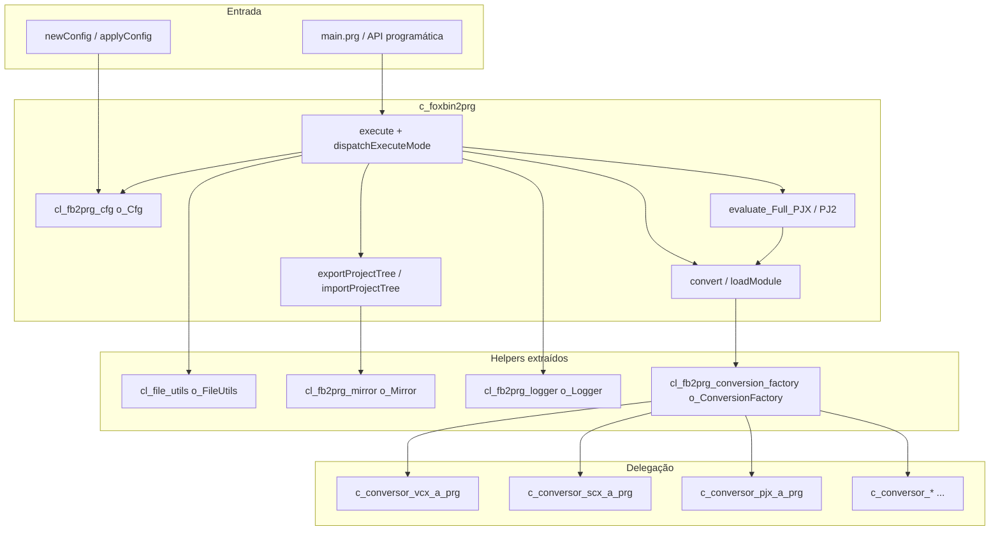
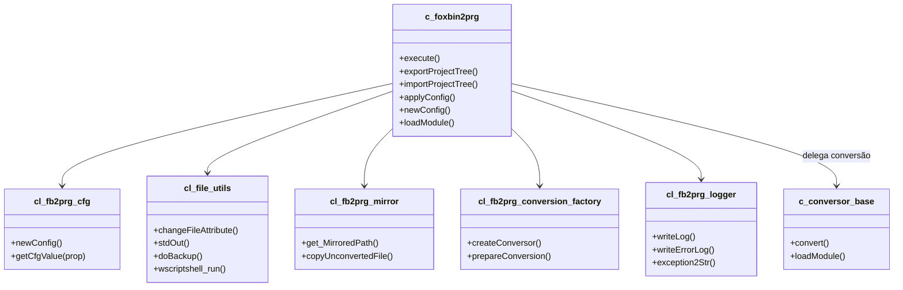
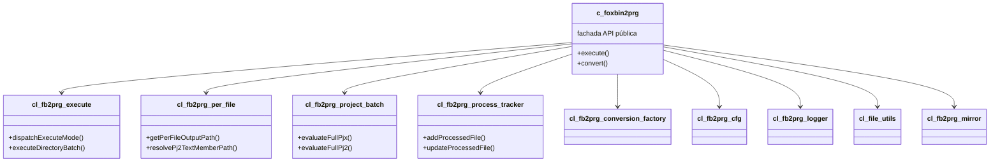

# Documentação: classe `c_foxbin2prg`

> Análise estrutural da classe orquestradora do FoxBin2Prg (Visual FoxPro 9).  
> Arquivo fonte modular: `c_foxbin2prg.prg` (~3.400 linhas, ~100 métodos).  
> Data da análise: 2026-06-29 (pós-modularização, factory, logger e plano de melhorias restantes)

---

## Visão geral

A classe **`c_foxbin2prg`** herda de **`Session`** e funciona como **orquestrador central** do FoxBin2Prg. Ela não faz a conversão binário↔texto em si; delega isso às classes `c_conversor_*` nos módulos `c_conversor_*.prg` listados em `unify.txt`. O monólito `foxbin2prg.prg` é gerado por `unify.prg` a partir desses fontes.



**Resumo numérico:** ~100 métodos públicos/protegidos, ~45 propriedades de sessão no host (opções de conversão residem no objeto CFG via `getCfgValue()`), 4 membros `Protected` na área `execute`, 2 `Hidden`.

---

## Estrutura de propriedades (por categoria)

### Identidade e versão

| Propriedade | Finalidade |
|---|---|
| `n_FB2PRG_Version`, `c_FB2PRG_Version_Real`, `c_FB2PRG_EXE_Version` | Versão interna e exibida |
| `c_Foxbin2prg_FullPath`, `c_Foxbin2prg_ConfigFile` | Caminho do executável/PRG e CFG principal |
| `c_CurDir`, `c_TempDir` | Diretório atual e temporário |
| `c_Language`, `c_Language_In` | Idioma das mensagens (EN/ES/FR/DE) |

### Entrada/saída da conversão

| Propriedade | Finalidade |
|---|---|
| `c_InputFile`, `c_OutputFile`, `c_OriginalFileName` | Arquivos em processamento |
| `c_ClassToConvert`, `c_ClassOperationType` | Classe individual (`arquivo.vcx::classe`) e Import/Export |
| `c_Type`, `c_Recompile`, `l_Recompile` | Tipo de saída e recompilação |
| `cOutputFolder`, `n_HomeDir` | Pasta de destino e gravação de HomeDir no PJ2 |
| `t_InputFile_TimeStamp`, `t_OutputFile_TimeStamp` | Timestamps para otimização |

### Estado de erro e log

| Propriedade | Finalidade |
|---|---|
| `l_Error`, `l_Errors`, `c_TextErr` | Erros da execução atual e acumulados |
| `c_LogFile`, `c_ErrorLogFile`, `c_TextLog` | Arquivos e buffer de log |
| `l_ShowErrors`, `n_Debug`, `n_DebugP` | Exibição de erros e debug |
| `l_StdOutHabilitado` | Saída para stdout/stderr (modo EXE) |

### Configuração (objeto CFG via `o_Cfg`)

| Propriedade / API | Finalidade |
|---|---|
| `o_Cfg` (`cl_fb2prg_cfg`) | Gerenciador: `o_CFG`, `newConfig()`, `applyConfig()`, `getCfgValue()` |
| `getCfgValue` / `setCfgValue` / `getCfgFlag` / `getCfgInt` | Leitura/escrita na CFG de sessão |
| `n_DebugP` | Override de CLI para `n_Debug` (prioridade sobre CFG) |

> **Nota (2026):** `foxbin2prg.cfg` em disco, `o_Configuration` (Collection), `evaluateConfiguration()` e os ~38 métodos `_ACCESS` foram removidos. Propriedades como `c_VC2`, `l_NoTimestamps`, `n_UseClassPerFile`, `l_CopyNonConvertible`, `l_ExportUTF8`, etc. existem apenas no objeto CFG retornado por `newConfig()` — consulte `getConfigPropertyCatalog()` em `cl_fb2prg_cfg.prg`.

### Extensões e suporte (via CFG)

Resolvidas em tempo de execução com `getCfgValue('c_VC2')`, `hasSupport_Bin2Prg()`, `get_Ext2FromExt()`, etc. O host não declara mais dezenas de propriedades `c_*2` / `n_*_Conversion_Support` duplicadas.

### Espelhamento (mirror)

| Propriedade | Finalidade |
|---|---|
| `cOutputFolder` | Pasta de destino na árvore espelhada |
| `cInputRoot` | Raiz do projeto/fonte espelhado |
| `l_MirrorExport` | `.T.` durante `evaluate_Full_PJX` |
| `o_Mirror` | Instância de `cl_fb2prg_mirror` (path mapping, cópia de não-convertíveis) |

### Class-per-file / Form-per-file / DBC split (via CFG)

Propriedades `n_UseClassPerFile`, `l_UseClassPerDir`, `n_UseFormPerFile`, `n_UseFilesPerDBC`, etc. — ver catálogo em `cl_fb2prg_cfg.prg`. Helpers no host: `getPerFileDir`, `getPerFileOutputPath`, `resolvePj2TextMemberPath`.

### Comportamento de conversão (via CFG)

`l_NoTimestamps`, `l_Recompile`, `n_OptimizeByFilestamp`, opções DBF/DBC, ordenação de métodos/props — todas via `getCfgValue()`. O host mantém apenas flags de teste unitário (`l_MethodSort_Enabled`, `l_PropSort_Enabled`, `l_ReportSort_Enabled`).

### Objetos auxiliares

| Propriedade | Finalidade |
|---|---|
| `o_FSO`, `o_WSH`, `o_TextStream` | FileSystemObject, WScript.Shell |
| `o_FileUtils` | `cl_file_utils` — Win32, paths, stdout, `wscriptshell_run` |
| `o_Mirror` | `cl_fb2prg_mirror` — árvore espelhada |
| `o_Cfg` | `cl_fb2prg_cfg` — configuração |
| `o_SpecialProps` | `cl_fb2prg_special_props` — ordem de propriedades |
| `o_Logger` | `cl_fb2prg_logger` — buffer/flush de log e erro, `exception2Str`, `doWriteErrorLog` |
| `o_ConversionFactory` | `cl_fb2prg_conversion_factory` — roteamento extensão → `c_conversor_*` |
| `run_AfterCreateTable`, `run_AfterCreate_DB2` | Hooks pós-criação DBF/DB2 |

---

## Métodos por categoria

### 1. Ciclo de vida

| Método | Linhas ~ | Finalidade |
|---|---|---|
| **`Init`** | 177–280 | Ambiente VFP, DLLs, logs, idioma, `o_FSO`, `ensureCfg()` / `ensureSpecialProps()` |
| **`Destroy`** | 283–328 | Flush de logs, libera forms/objetos, `o_FileUtils.clearDll()` |

### 2. Ponto de entrada principal (`execute` refatorado)

| Método | Linhas ~ | Finalidade |
|---|---|---|
| **`execute`** | 1640–1728 (~90) | API pública: valida ambiente, monta contexto, despacha modo |
| **`dispatchExecuteMode`** | 1514–1553 | `DO CASE` central: arquivo único, diretório, PJX/PJ2, wildcard, UI vazia |
| **`resolveExecuteMode`** | 1225–1270 | Determina modo a partir de extensão e `tcType` |
| **`buildExecuteContext`** | 1208–1223 | Objeto `loCtx` com flags bin/text e CFG efetiva |
| **`mergeExecuteConfig`** | 1029–1043 | Mescla `toCfg` na sessão antes da conversão |
| **`beginExecuteSession`** / **`finalizeExecuteSession`** | 1045–1637 | Setup/teardown de ESC, notify, log, progress bar |
| **`executeSingleFile`** / **`executeDirectoryBatch`** / **`executeSingleProject`** | 1461–1498 | Handlers por modo |
| **`executeBin3Prg`** / **`executePrg3Bin`** | 1348–1382 | Aliases internos → `exportProjectTree` / `importProjectTree` |

### 3. Espelhamento de projeto

| Método | Finalidade |
|---|---|
| **`exportProjectTree`** | PJX → árvore espelhada em texto (`execute` com `*`) |
| **`importProjectTree`** | PJ2 → regenera binários na pasta destino |
| Wrappers | `get_MirroredPath`, `isExcludedSubdir`, `copyUnconvertedFile`, `makeDirTree` → delegam a `o_Mirror` |

### 4. Codificação UTF-8 (export/import)

| Método | Finalidade |
|---|---|
| **`isExportUTF8`** | Lê `l_ExportUTF8` da CFG |
| **`encodeTextForExport`** / **`decodeTextFromImport`** | `StrConv` ANSI ↔ UTF-8 |
| **`readTextFile`** / **`writeTextFile`** | I/O de arquivos texto respeitando CFG |
| **`finalizeTextExportFile`** | Converte arquivo ANSI temporário para UTF-8 in-place |

### 5. Conversão de arquivos

| Método | Visibilidade | Finalidade |
|---|---|---|
| **`convert`** | Protected | Conversão completa (linhas ~2082–2436): factory, otimização por timestamp, per-file, recompilação |
| **`loadModule`** | Public | Unit tests (~3101): delega a `convert(..., 'LOAD_ONLY')` |
| **`compileFoxProBinary`** | Public | `COMPILE CLASSLIB/FORM/REPORT/...` após regeneração |
| **`get_PROGRAM_HEADER`** | Public | Cabeçalho meta dos arquivos texto |

### 6. Processamento de projetos

| Método | Finalidade |
|---|---|
| **`evaluate_Full_PJX`** | Bin→Txt de todos os membros do PJX (~1977–2019); delega ao pipeline compartilhado |
| **`evaluate_Full_PJ2`** | Txt→Bin a partir do bloco `BUILD PROJECT` no PJ2 (~2022–2064); delega ao pipeline compartilhado |

Helpers protegidos compartilhados (linhas ~1735–1974). Convenção: parâmetros **OUT** ou arrays mutáveis são passados com `@` na **chamada**; em `LPARAMETERS` o nome aparece **sem** `@`. Arrays recebidos por parâmetro exigem `EXTERNAL ARRAY <nome>` logo após `LPARAMETERS` (antes de `LOCAL`). Em `collectPj2MemberList`, `taPjxExcluded` é preenchido com `DIMENSION`/`ACOPY` (não atribuição `=`), para respeitar a referência do caller.

#### `setupProjectBatchEnvironment`

| Parâmetro | Modo | Descrição |
|---|---|---|
| `tcInputFile` | IN | Caminho do projeto (.PJX ou .PJ2) |
| `tcLogFile` | IN | Log explícito; vazio = `<pasta_projeto>\*_ALL.LOG` |
| `tcRecompile` | IN | `'1'`, diretório ou vazio (mesma semântica de `evaluate_Full_*`) |
| `tlBinToText` | IN | `.T.` export PJX; `.F.` import PJ2 |
| `tcFileSpec` | OUT | `FULLPATH(tcInputFile)` — passar `@tcFileSpec` |
| `loLang` | OUT | `_SCREEN.o_FoxBin2Prg_Lang` — passar `@loLang` |

#### `collectPjxMemberList`

| Parâmetro | Modo | Descrição |
|---|---|---|
| `tcInputFile` | IN | Caminho do .PJX |
| `tcFileSpec` | IN | Caminho completo do projeto (base para `NAME` relativos) |
| `taMembers` | OUT | Array 2 colunas: `(1)` path absoluto, `(2)` flag `EXCLUDE` — passar `@taMembers` |
| `tnFileCount` | OUT | Quantidade de membros — passar `@tnFileCount` |

#### `collectPj2MemberList`

| Parâmetro | Modo | Descrição |
|---|---|---|
| `tcInputFile` | IN | Caminho do .PJ2 |
| `tcFileSpec` | IN | Caminho completo do projeto espelhado |
| `taMembers` | OUT | Array 2 colunas: `(1)` texto, `(2)` binário — passar `@taMembers` |
| `tnFileCount` | OUT | Linhas `.ADD('…')` válidas — passar `@tnFileCount` |
| `taPjxExcluded` | OUT | Paths excluídos via `FileExclusions` — passar `@taPjxExcluded` |

#### `convertProjectHeaderIfNeeded`

| Parâmetro | Modo | Descrição |
|---|---|---|
| `tcInputFile` | IN | PJX ou PJ2 |
| `tcType` | IN | `'*-'` pula conversão do cabeçalho do projeto |
| `tcOriginalFileName` | IN | Nome original para metadados |
| `toModulo` | OUT | Objeto conversor (testes) |
| `toEx` | OUT | Exceção — passar `@toEx` |

#### `processProjectMembersLoop`

| Parâmetro | Modo | Descrição |
|---|---|---|
| `taMembers` | IN (`@`) | Lista de membros (ver `collectPjx*` / `collectPj2*`) |
| `tnFileCount` | IN | Total de linhas |
| `tcOriginalFileName` | IN | Repassado a `convert()` |
| `toModulo` | OUT | Objeto conversor |
| `toEx` | OUT | Exceção — passar `@toEx` |
| `loLang` | IN | Mensagens de progresso |
| `tlBinToText` | IN | Direção do batch |
| `taPjxExcluded` | IN (`@`) | Lista de exclude no import; array vazio no export |

#### Demais helpers (resumo)

| Método | Parâmetros principais | Retorno |
|---|---|---|
| **`isProjectMemberPjxExcluded`** | `tlBinToText`, `@taMembers`, `tnIndex`, `@taPjxExcluded` | `.T.` se exclude PJX |
| **`registerSkippedProjectMember`** | `tcFile`, `tcReason` (`subdir` \| `pjx` \| `outside`) | — |
| **`shouldProcessProjectMemberOutsideRoot`** | `lcFile`, `loLang` | `.T.` continua; `.F.` skip; ERROR se `n_CheckFileInPath=1` |
| **`isProjectMemberConvertible`** | `lcFile`, `lcBinFile`, `tlBinToText`, `@laDirInfo` | `.T.` se deve converter |
| **`copyNonConvertibleProjectMember`** | `lcFile`, `lcBinFile`, `tlBinToText`, `@laDirInfo` | — |
| **`convertProjectMember`** | `lcFile`, `tcOriginalFileName`, `toModulo`, `toEx`, `llBatchError` | Código de erro; `@llBatchError` |
| **`finalizeProjectBatch`** | `llMirrorExportSave`, `loLang` | Restaura mirror; `@loLang` |

Métodos com `EXTERNAL ARRAY` (parâmetro array): `collectPjxMemberList` (`taMembers`), `collectPj2MemberList` (`taMembers`, `taPjxExcluded`), `isProjectMemberPjxExcluded` (`taMembers`, `taPjxExcluded`), `isProjectMemberConvertible` / `copyNonConvertibleProjectMember` (`laDirInfo`), `processProjectMembersLoop` (`taMembers`, `taPjxExcluded`). Fora do batch: `get_Processed`, `get_FilesFromDirectory`, `readInputVFPParams`, `set_Line`, `finalizeExecuteSession` (`laDirInfo`).

### 7. Configuração (`cl_fb2prg_cfg` via `o_Cfg`)

| Método | Finalidade |
|---|---|
| **`applyConfig`** | Copia objeto CFG para `o_CFG` (`lockMasterFromObject`) |
| **`newConfig`** | Clone dos defaults de fábrica para uso programático |
| **`get_DirSettings`** | Retorna clone de fábrica (`newConfig()`); **não lê disco** |
| **`getCfgValue` / `setCfgValue`** | Leitura/escrita na CFG de sessão |
| **`writeLogDbfCfgSettings`** | Log das propriedades DBF da sessão (`c_DBF_*`, `n_DBF_Conversion_Support`) |
| **`formatConfigReferenceText`** | Texto de referência para `frm_main` |

Delegação: lógica em `cl_fb2prg_cfg.prg`; `c_foxbin2prg` expõe wrappers (`ensureCfg()` + `o_Cfg.*`). Helpers lazy: `ensureFileUtils()`, `ensureMirror()`, `ensureSpecialProps()`.

> **Removido:** `evaluateConfiguration()`, métodos `_ACCESS` para propriedades CFG, `frm_interactive`.

### 8. Suporte e detecção de tipos

| Método | Finalidade |
|---|---|
| **`hasSupport_Bin2Prg`** | Arquivo suporta binário→texto? |
| **`hasSupport_Prg2Bin`** | Arquivo suporta texto→binário? |
| **`conversionSupportType`** | Retorna nível numérico de suporte (modo VSS) |
| **`get_Ext2FromExt`** | Mapeia VCX→VC2, PJX→PJ2, etc. |
| **`filenameFoundInFilter`** | Filtro wildcard para inclusão/exclusão |
| **`get_TextExtForBinFile`** / **`resolvePj2TextMemberPath`** | Extensão texto e path de membro PJ2 (class-per-file) |

### 9. Sistema de arquivos e backup

| Método | Finalidade |
|---|---|
| **`changeFileAttribute`** / **`changeFileTime`** | Delegam a `o_FileUtils` |
| **`doBackup`** | Wrapper → `o_FileUtils.doBackup` (backup em cascata .BAK, .01.BAK, …) |
| **`comparedFilesAreEqual`** | Delega a `o_FileUtils` |
| **`renameFile`** | Capitalização via `filename_caps` |
| **`renameTmpFile2Tx2File`** | Delega a `o_FileUtils` |
| **`get_FilesFromDirectory`** | Varredura recursiva |
| **`get_AbsolutePath`** | Delega a `o_FileUtils` |

### 10. Rastreamento de arquivos processados

| Método | Finalidade |
|---|---|
| **`addProcessedFile`** | Registra arquivo no array `a_ProcessedFiles(6 cols)` |
| **`wasProcessed`** | Verifica se já foi processado (evita reprocesso) |
| **`updateProcessedFile`** | Atualiza flags P/E/S/X do registro |
| **`clearProcessedFiles`** | Limpa estatísticas entre execuções |
| **`get_Processed`** | Exporta array filtrado por máscara (API) |

### 11. Logging e saída console

| Método | Finalidade |
|---|---|
| **`writeLog`** / **`writeErrorLog`** (+ `_Flush`) | Wrappers → `o_Logger` |
| **`stdOut`** / **`errOut`** | Delegam a `o_FileUtils` |
| **`doWriteErrorLog`** (Hidden) | Formata exceção e grava `.ERR` |
| **`exception2Str`** (Hidden) | Serializa objeto `Exception` |

### 12. UI e internacionalização

| Método | Finalidade |
|---|---|
| **`changeLanguage`** | Instancia `CL_LANG` em `_Screen` |
| **`loadProgressbarForm`** / **`unloadProgressbarForm`** | Form `frm_avance` |
| **`updateProgressbar`** | Proxy para barra de progresso; ESC → erro 1799 |
| **`getLocaleInfo`** | Idioma do SO via `GetLocaleInfoEx` |

### 13. Utilitários VFP / Windows

| Método | Finalidade |
|---|---|
| **`declareDLL`** | Delega a `o_FileUtils` |
| **`readInputVFPParams`** | Parse da linha de comando Windows (permanece no host) |
| **`get_SeparatedLineAndComment`** | Separa linha de código e comentário `&&` (cópia em `cl_cus_base.prg`) |
| **`normalizeFileCapitalization`** | Capitalização de nomes via `filename_caps` |
| **`wscriptshell_run`** | Wrapper → `o_FileUtils` |
| **`FERROR_Message`** / **`getLocaleInfo`** | Wrapper → `o_FileUtils` |

---

## Índice de métodos (referência rápida)

| Linha ~ | Método |
|---|---|
| 177 | `Init` |
| 283 | `Destroy` |
| 332 | `addProcessedFile` |
| 443–473 | `ensureFileUtils` / `ensureMirror` / `ensureCfg` / `ensureSpecialProps` / `ensureConversionFactory` / `ensureLogger` |
| 997–1637 | Métodos protegidos do pipeline `execute` |
| 1640 | `execute` |
| 1735–1974 | Helpers project batch (`setupProjectBatchEnvironment`, `processProjectMembersLoop`, …) |
| 1977 | `evaluate_Full_PJX` |
| 2022 | `evaluate_Full_PJ2` |
| 2074 | `convert` (Protected) |
| 2439–2525 | Wrappers CFG (`newConfig`, `applyConfig`, `getCfgValue`, …) |
| 2532 | `exportProjectTree` |
| 2554 | `importProjectTree` |
| 2583–2768 | Per-file (`getPerFileDir`, `getPerFileOutputPath`, …) |
| 2771–2796 | Wrappers mirror (`get_MirroredPath`, `copyUnconvertedFile`, …) |
| 3101 | `loadModule` |
| 3188–3258 | UTF-8 (`isExportUTF8`, `readTextFile`, `writeTextFile`, …) |
| 2864 | `get_SeparatedLineAndComment` |
| 2951 | `normalizeFileCapitalization` |

> **Nota:** números de linha referem-se a `c_foxbin2prg.prg` modular (~3.400 linhas). Podem variar após edições.

---

## Carga restante no host (pós-2026)

Após factory, logger e refatoração do `execute`, o orquestrador continua legítimo como **SESSION VFP** e fachada pública (Thor, SCM, testes). O que ainda pesa no arquivo:

| Bloco | Linhas ~ | Observação |
|---|---|---|
| Pipeline `execute` (helpers protegidos) | ~640 | Bem decomposto (`dispatchExecuteMode`, handlers), mas ainda no host |
| `convert` | ~350 | Maior método restante |
| `evaluate_Full_PJX` + `evaluate_Full_PJ2` | ~90 + helpers ~240 | **Unificado** — loop em `processProjectMembersLoop` |
| Per-file VCX/SCX/DBC | ~280 | Usado por factory, conversores e resolução PJ2 |
| UTF-8 / text I/O | ~90 | Usado por mirror e conversores |
| Process tracker | ~120 | Array `a_ProcessedFiles` |
| `get_SeparatedLineAndComment` | ~85 | **Cópia idêntica** em `cl_cus_base.prg` |
| Wrappers finos (CFG, mirror, logger, file utils) | ~200 | Fachada intencional — não remover |

---

## Problemas estruturais identificados

| Problema | Impacto | Estado |
|---|---|---|
| **`execute` monolítico (~1.170 linhas)** | Dificultava manutenção | **Resolvido** — ~90 linhas + `dispatchExecuteMode` e handlers |
| **~38 métodos `_ACCESS` repetitivos** | Boilerplate de CFG | **Resolvido** — removidos; uso de `getCfgValue()` |
| **Duplicação `convert` ↔ `loadModule`** | Factory repetida | **Resolvido** — `cl_fb2prg_conversion_factory` + `convert(tcMode)` |
| **`doBackup` / logging no host** | God Object | **Mitigado** — `cl_fb2prg_logger`; `doBackup` em `cl_file_utils` (wrapper no host) |
| **I/O Win32 no orquestrador** | Responsabilidade OS misturada | **Parcial** — `cl_file_utils` e `cl_fb2prg_mirror` extraídos |
| **Duplicação PJX ↔ PJ2** | Risco de divergência em batch | **Resolvido** — `processProjectMembersLoop` e helpers compartilhados |
| **`convert` ainda grande** | Difícil manter otimizações per-file | **Pendente** — blocos VCX/SCX/DBC repetidos internamente |
| **`get_SeparatedLineAndComment` duplicado** | ~85 linhas × 2 arquivos | **Pendente** — `c_foxbin2prg` e `cl_cus_base` |
| **Bug em `updateProcessedFile`** | Coluna 2 usa `tcProcessed` em vez de `tcInOutType` | **Pendente** — mascarado pelos call sites atuais |

---

## Plano de melhorias restantes

### Concluído (2025–2026)

| Item | Módulo / resultado |
|---|---|
| CFG object-only, sem `_ACCESS` nem `.cfg` em disco | `cl_fb2prg_cfg.prg` |
| Win32, paths, stdout, `wscriptshell_run`, `doBackup` | `cl_file_utils.prg` |
| Árvore espelhada, subdirs excluídos, cópia | `cl_fb2prg_mirror.prg` |
| Factory de conversores + `prepareConversion` | `cl_fb2prg_conversion_factory.prg` |
| Logger + `exception2Str` / `doWriteErrorLog` | `cl_fb2prg_logger.prg` |
| Unificar `convert` / `loadModule` (`tcMode`: `FULL` \| `LOAD_ONLY`) | `c_foxbin2prg.prg` |
| Refatorar `execute` em despacho por modo | `c_foxbin2prg.prg` |
| Modularização (`c_*.prg` / `cl_*.prg` + `unify.txt`) | Repositório |

### Prioridade alta (maior impacto, risco controlado)

#### 1. Unificar `evaluate_Full_PJX` e `evaluate_Full_PJ2` (~340 → ~180 linhas)

**Concluído (2026-06-29).** Helpers protegidos compartilhados:

- `setupProjectBatchEnvironment`, `collectPjxMemberList`, `collectPj2MemberList`
- `convertProjectHeaderIfNeeded`, `processProjectMembersLoop`
- `isProjectMemberPjxExcluded`, `registerSkippedProjectMember`, `shouldProcessProjectMemberOutsideRoot`
- `isProjectMemberConvertible`, `copyNonConvertibleProjectMember`, `convertProjectMember`
- `finalizeProjectBatch`

`evaluate_Full_PJX` e `evaluate_Full_PJ2` reduzidos a setup de direção (`l_MirrorExport`, `tlBinToText`) + coleta de membros específica + loop unificado.

#### 2. Refatorar `convert` internamente (~350 linhas)

Sem mudar assinatura pública. Extrações sugeridas:

```foxpro
resolveInputBaseFile(lcExtension, lcInputFile)   && VCX/SCX/DBC — blocos quase idênticos hoje
bindConversorFromHost(loConversor)               && props duplicadas FULL vs LOAD_ONLY
shouldSkipByFilestamp(...)                       && otimização por timestamp
```

**Ganho:** método mais legível; hoje é o ponto mais difícil de manter.

#### 3. Extrair `cl_fb2prg_per_file` (~280 linhas)

Candidatos:

- `getPerFileDir`, `getPerFileOutputPath`, `getPerFileSearchDir`, `getPerFileBinaryOutputPath`, `ensurePerFileDir`
- `resolvePj2TextMemberPath`, `isPj2TextMemberAvailable`
- `rewritePerObjectInputPath` (parte do pipeline `execute`)

Incluir helper interno `normalizePerFileParams(tlUsePerDir, lnUsePerFile)` para eliminar boilerplate repetido em cada método.

Manter wrappers em `c_foxbin2prg` para API estável. Usado por `cl_fb2prg_conversion_factory`, conversores `prg_a_*` e batch de projetos.

### Prioridade média

#### 4. Extrair pipeline `execute` → `cl_fb2prg_execute` (~640 linhas)

Bloco protegido (linhas ~997–1637): `dispatchExecuteMode`, `executeDirectoryBatch`, `executeWildcardBatch`, etc. Classe helper com referência `o_Host`; `execute()` permanece fachada.

**Ganho:** host ~2.700 linhas; legibilidade. **Risco:** baixo se API pública não mudar.

#### 5. `cl_fb2prg_text_io` — UTF-8 e I/O texto (~90 linhas)

`isExportUTF8`, `encodeTextForExport`, `decodeTextFromImport`, `readTextFile`, `writeTextFile`, `finalizeTextExportFile`, `comparedTextExportFilesEqual`, `isTextFileForEncoding`.

Pode integrar `cl_file_utils` ou classe dedicada. Usado por `cl_fb2prg_mirror` e conversores.

#### 6. `cl_fb2prg_process_tracker` (~120 linhas)

`addProcessedFile`, `wasProcessed`, `updateProcessedFile`, `clearProcessedFiles`, `get_Processed`. Wrappers no host preservam chamadas `toFoxBin2Prg.updateProcessedFile()` nos conversores.

#### 7. Deduplicar `get_SeparatedLineAndComment`

Mover para módulo compartilhado (ex.: `cl_fb2prg_code_parser.prg`); `c_foxbin2prg` e `cl_cus_base` delegam.

#### 8. `normalizeFileCapitalization` + `renameFile` (~150 linhas)

Lógica de `filename_caps` acoplada ao host; candidata a `cl_file_utils` ou `cl_fb2prg_filename_caps`.

### Correção pontual (diff pequeno, qualidade real)

Em `updateProcessedFile`, coluna 2 do array parece usar parâmetro errado:

```foxpro
IF NOT EMPTY(tcInOutType)
   .a_ProcessedFiles(tnID, 2) = EVL(tcProcessed, '')   && deveria ser tcInOutType
ENDIF
```

Call sites atuais (`updateProcessedFile()` sem args ou `updateProcessedFile(lnID, '', '', 'E1')`) provavelmente mascaram o bug; corrigir antes de extrair o process tracker.

### Ordem de implementação recomendada

1. ~~Unificar loop PJX/PJ2~~ **Concluído (2026-06-29)**
2. Refatorar `convert` por dentro (sem mudar assinatura)
3. Extrair `cl_fb2prg_per_file`
4. Corrigir `updateProcessedFile`
5. Opcional: `cl_fb2prg_execute`, text I/O, process tracker, code parser

Após extrações que alterem módulos listados em `unify.txt`, executar `unify.prg` para regenerar `foxbin2prg.prg`.

### O que **não** extrair desta classe

| Item | Motivo |
|---|---|
| Conversores `c_conversor_*` e modelos `CL_*` | Já modularizados em `unify.txt` |
| Wrappers finos (`getCfgValue`, `writeLog`, `doBackup`, mirror) | Fachada deliberada para Thor, SCM e código legado |
| Herança `Session` e estado de sessão VFP | O host deve continuar coeso como ponto de entrada |
| Eliminar `WITH THIS AS c_foxbin2prg` | Cosmético; sem ganho funcional |
| Quebrar em múltiplas classes de domínio | Orquestrador ≠ conversor ≠ modelo |

---

## Arquitetura atual (pós-modularização)



### Arquitetura alvo (opcional, pós-plano)



---

## Conclusão

`c_foxbin2prg` concentra **orquestração**, **delegação de conversão**, **batch de projetos** e **API de espelhamento**. Desde 2025–2026 a classe encolheu (~6.000 → ~3.400 linhas) com:

1. CFG object-only em `cl_fb2prg_cfg`
2. Helpers `cl_file_utils`, `cl_fb2prg_mirror`, `cl_fb2prg_logger`, `cl_fb2prg_conversion_factory`
3. `execute` refatorado com despacho por modo
4. `convert` / `loadModule` unificados via `tcMode`
5. Suporte UTF-8 (`l_ExportUTF8`) integrado ao pipeline texto

O retorno marginal das próximas extrações é menor que o já realizado, mas ainda há ganhos significativos em **unificação PJX/PJ2**, **refatoração interna de `convert`** e **módulo per-file**. A API pública deve permanecer estável para SCM, Thor e testes unitários.

---

## Documentos relacionados

- [arquitetura.md](arquitetura.md) — visão geral da arquitetura modular
- [export_import_mirror.md](export_import_mirror.md) — espelhamento de projetos
- [FoxBin2Prg_Internals.md](FoxBin2Prg_Internals.md) — opções de CFG e uso
- `unify.txt` — lista de módulos-fonte; `c_foxbin2prg.prg` é o orquestrador modular
