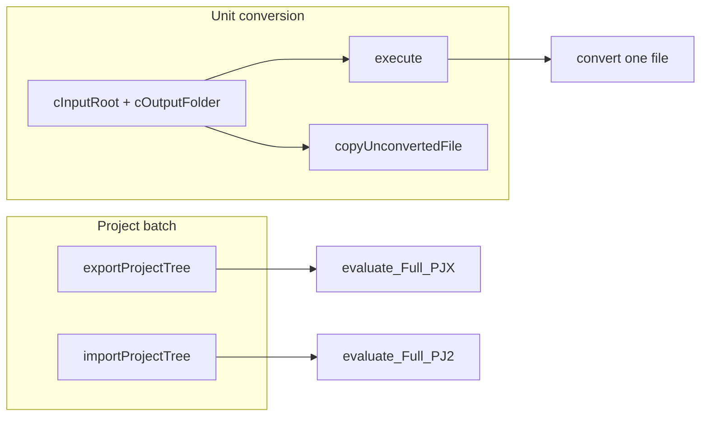

# Unit conversion with a mirrored tree

`exportProjectTree` / `importProjectTree` convert an **entire** project. This guide covers the same mirrored-folder mapping for **one** member (or one class / form object): set session roots (`cInputRoot` + `cOutputFolder`), then call `execute()` — or `copyUnconvertedFile()` for files FoxBin2Prg does not convert.

Full-project API and project-member options: [export_import_mirror.md](./export_import_mirror.md). Interactive batch driver for this repo: [`mirror.prg`](../mirror.prg). Low-level root setup: examples 4–5 in [`create_mirrored.prg`](../create_mirrored.prg).



---

## When to use which API

| Goal | API |
|------|-----|
| Whole project (PJX/PJ2 + all members) | `exportProjectTree` / `importProjectTree` |
| One convertible file (or one class/object) | Set `cInputRoot` + `cOutputFolder`, then `execute(tcInput, '', loCfg)` |
| One non-convertible file (`.prg`, `.bmp`, …) | Set roots, then `copyUnconvertedFile(tcFile)` |

There is no `exportClassTree` / `importClassTree`. Unit work reuses the same path mapper as the project APIs (`get_MirroredOutputFile` / `get_MirroredPath` in `cl_fb2prg_mirror` / `c_conversor_base`).

---

## Common setup

Use the **same CFG** as your project round-trip (class/form-per-file, UTF-8, etc.). Direction is inferred from the input extension when `tcType` is empty (`.vcx` → text, `.vc2` → binary). Invert the roots between export and import.

```foxpro
LOCAL loF2b, loCfg, loEx, lnResp
LOCAL lcBinRoot, lcScmRoot

lcBinRoot = 'd:\src\app\'      && binary / PJX tree
lcScmRoot = 'd:\export\app\'   && mirrored text / SCM tree

DO GetObj_F2b IN foxbin2prg.prg WITH loF2b
loCfg = loF2b.newConfig()

*-- Match your project mirror CFG (example: class-per-file + per-dir)
loCfg.l_NoTimestamps              = .T.
loCfg.l_ExportUtf8                = .T.
loCfg.n_UseClassPerFile           = 1
loCfg.l_UseClassPerDir            = .T.
loCfg.l_RedirectClassPerFileToMain = .T.
loCfg.n_RedirectClassType         = 0
loCfg.l_CopyLowercaseNames        = .T.

*-- Export BIN -> SCM
loF2b.cInputRoot    = lcBinRoot
loF2b.cOutputFolder = lcScmRoot
lnResp = loF2b.execute( lcBinRoot + 'libs\mylib.vcx', '', loCfg, @loEx )

*-- Import SCM -> BIN (roots swapped)
loF2b.cInputRoot    = lcScmRoot
loF2b.cOutputFolder = lcBinRoot
lnResp = loF2b.execute( lcScmRoot + 'libs\mylib.vc2\mylib.vc2', '', loCfg, @loEx )
```

`exportProjectTree` / `importProjectTree` call `o_Mirror.setProjectRoots` and then `execute(..., '*')`. For unit conversion you set the roots yourself (same fields).

---

## Mirror options vs unit `execute`

| Concern | Project batch (`exportProjectTree` / `importProjectTree`) | Unit `execute` with roots set |
|---------|-----------------------------------------------------------|-------------------------------|
| Path remapping under `cOutputFolder` | Yes | Yes (`get_MirroredOutputFile` / `get_MirroredPath`) |
| `c_ExcludedSubdirs` | Yes (per PJX/PJ2 member) | No (you choose the file) |
| `l_CopyExcludedPjxFiles` | Yes | No |
| `l_CopyNonConvertible` | Yes (auto-copy in the member loop) | Use `copyUnconvertedFile` yourself |
| Class/form CFG (`n_UseClassPerFile`, …) | Yes | Yes (passed via `loCfg`) |
| `l_ExportUTF8` | Yes | Yes |

Use the same `loCfg` object for unit and full-project round-trips so layout stays consistent.

---

## Convertible types (unit `execute`)

These are the extensions `hasSupport_Bin2Prg` / `hasSupport_Prg2Bin` recognize in the project member loop. Text extension names follow CFG defaults (`c_VC2` = `VC2`, etc.).

| Binary | Text | Export input | Import input | Notes |
|--------|------|--------------|--------------|-------|
| VCX | VC2 | `lib.vcx` or `lib.vcx::ClassName::E` | `lib.vc2` or per-class file under `lib.vc2\` | See [Single class (VCX)](#single-class-vcx) |
| SCX | SC2 | `form.scx` or `form.scx::Object::E` | `form.sc2` or per-object file | See [Single form object (SCX)](#single-form-object-scx) |
| FRX | FR2 / FR2D | `report.frx` | `report.fr2` (or FR2D for Fox2x) | No `::` syntax |
| LBX | LB2 / LB2D | `label.lbx` | `label.lb2` | Same as FRX |
| MNX | MN2 | `menu.mnx` | `menu.mn2` | Single file |
| DBC | DC2 | `data.dbc` | `data.dc2` (+ item files if `UseFilesPerDBC`) | See [Database (DBC)](#database-dbc) |
| DBF | DB2 | `table.dbf` | `table.db2` | See [Table (DBF)](#table-dbf) |
| FKY | FK2 | `file.fky` | `file.fk2` | Single file |
| MEM | ME2 | `file.mem` | `file.me2` | Single file |
| PJX | PJ2 | `app.pjx` | `app.pj2` | **Header only** — does not process members. Use `exportProjectTree` / `importProjectTree` (or `execute` with `tcType = '*'`) for the full project |

### Reports and labels (FRX / LBX)

```foxpro
loF2b.cInputRoot    = lcBinRoot
loF2b.cOutputFolder = lcScmRoot
lnResp = loF2b.execute( lcBinRoot + 'reports\sales.frx', '', loCfg, @loEx )

loF2b.cInputRoot    = lcScmRoot
loF2b.cOutputFolder = lcBinRoot
lnResp = loF2b.execute( lcScmRoot + 'reports\sales.fr2', '', loCfg, @loEx )
```

Fox2x reports/labels may use the `c_FR2D` / `c_LB2D` extensions instead of `FR2` / `LB2`.

### Menus, FKY, MEM

Same pattern: pass the binary path to export, the text path to import, with roots swapped.

### Database (DBC)

```foxpro
lnResp = loF2b.execute( lcBinRoot + 'data\app.dbc', '', loCfg, @loEx )   && -> app.dc2 in scm
lnResp = loF2b.execute( lcScmRoot + 'data\app.dc2', '', loCfg, @loEx )   && -> app.dbc in bin
```

With `n_UseFilesPerDBC > 0` and related redirect options, the library may split into a header `.dc2` plus per-item files. Unit import of a single item file follows the DBC per-file / redirect rules (not the VCX `::` syntax). See [FoxBin2Prg_Internals.md](./FoxBin2Prg_Internals.md) for `UseFilesPerDBC`, `RedirectFilePerDBCToMain`, and `ItemPerDBCCheck`.

### Table (DBF)

Default `n_DBF_Conversion_Support` is **export-oriented** (structure to text). Bidirectional import requires `2` or `8` (see Internals). Data restore has separate rules and is easy to misuse — prefer full-project policy over ad-hoc unit import unless you know the CFG value in use.

### Project header (PJX / PJ2)

```foxpro
* Header only — not the same as exportProjectTree
lnResp = loF2b.execute( lcBinRoot + 'app.pjx', '', loCfg, @loEx )
```

To process all members, use `exportProjectTree` / `importProjectTree`, or `execute(pjxOrPj2, '*', loCfg)` with roots already set.

---

## Single class (VCX)

Requires class-per-file style CFG for useful per-class files, e.g. as in [`mirror.prg`](../mirror.prg):

```foxpro
loCfg.n_UseClassPerFile            = 1
loCfg.l_UseClassPerDir             = .T.
loCfg.l_RedirectClassPerFileToMain = .T.
loCfg.n_RedirectClassType          = 0   && project round-trip default
```

With `n_UseClassPerFile = 1` and `l_UseClassPerDir = .T.`, a class `cus_client` in `libs\mylib.vcx` maps to:

`libs\mylib.vc2\mylib.cus_client.vc2`

### Syntax

Parsed by `cl_fb2prg_execute.parseClassOperationSyntax`:

| Input | Meaning |
|-------|---------|
| `path\lib.vcx::ClassName` | Single class; operation defaults to **E** (export) |
| `path\lib.vcx::ClassName::E` or `::export` | Explicit export |
| `path\lib.vcx::ClassName::I` or `::import` | Explicit import |

### Export (BIN → SCM)

```foxpro
loF2b.cInputRoot    = lcBinRoot
loF2b.cOutputFolder = lcScmRoot
lnResp = loF2b.execute( lcBinRoot + 'libs\mylib.vcx::cus_client::E', '', loCfg, @loEx )
*-- writes scm\libs\mylib.vc2\mylib.cus_client.vc2
```

Path mapping: the converter builds the per-file path next to the source VCX, then `get_MirroredOutputFile` remaps it under `cOutputFolder` relative to `cInputRoot`.

### Import (SCM → BIN) — recommended

`::I` rewrites the input to a VC2 path **beside the VCX** (binary tree). In a true mirrored layout the text lives under SCM, so prefer the SCM `.vc2` path and `n_RedirectClassType = 2` (update only that class in the library):

```foxpro
LOCAL lnOld
lnOld = loCfg.n_RedirectClassType
loCfg.n_RedirectClassType = 2

loF2b.cInputRoot    = lcScmRoot
loF2b.cOutputFolder = lcBinRoot
lnResp = loF2b.execute( lcScmRoot + 'libs\mylib.vc2\mylib.cus_client.vc2', '', loCfg, @loEx )

loCfg.n_RedirectClassType = lnOld
```

With `n_RedirectClassType = 2`, the class name is taken from the per-file stem (`mylib.cus_client.vc2` → `cus_client`).

### Why not import with project CFG alone?

With `n_RedirectClassType = 0` and `l_RedirectClassPerFileToMain = .T.` (as in `mirror.prg`), feeding a single `lib.classname.vc2` typically redirects to the library header and can pull in **all** per-class files under `lib.vc2\` — library rebuild, not a single-class patch. Use `n_RedirectClassType = 2` for unit class import.

### `::I` from the VCX path

```foxpro
loF2b.execute( lcBinRoot + 'libs\mylib.vcx::cus_client::I', '', loCfg, @loEx )
```

Looks for the VC2 beside the VCX (e.g. `bin\libs\mylib.vc2\...`). That matches co-located text+binary trees, not the usual scm/bin split.

### Helper snippets

```foxpro
FUNCTION ExportClass
LPARAMETERS pcVcx, pcClass, pcBinRoot, pcScmRoot, poCfg, poF2b
LOCAL loEx, lnResp
   poF2b.cInputRoot    = Addbs(pcBinRoot)
   poF2b.cOutputFolder = Addbs(pcScmRoot)
   lnResp = poF2b.execute( ForceExt(pcVcx,'vcx') + '::' + pcClass + '::E', '', poCfg, @loEx )
RETURN lnResp = 0

FUNCTION ImportClass
LPARAMETERS pcVc2, pcScmRoot, pcBinRoot, poCfg, poF2b
LOCAL loEx, lnResp, lnOld
   lnOld = poCfg.n_RedirectClassType
   poCfg.n_RedirectClassType = 2
   poF2b.cInputRoot    = Addbs(pcScmRoot)
   poF2b.cOutputFolder = Addbs(pcBinRoot)
   lnResp = poF2b.execute( pcVc2, '', poCfg, @loEx )
   poCfg.n_RedirectClassType = lnOld
RETURN lnResp = 0
```

---

## Single form object (SCX)

Analogous to classes, when form-per-file is enabled:

```foxpro
loCfg.l_UseFormSettings           = 1
loCfg.n_UseFormPerFile            = 1   && or 2
loCfg.l_UseFormPerDir             = .T.
loCfg.l_RedirectFormPerFileToMain = .T.
loCfg.n_RedirectFormType          = 0   && project default; use 2 for unit object import
```

Syntax (same parser as VCX):

| Input | Meaning |
|-------|---------|
| `path\form.scx::ObjectName` | Defaults to export |
| `path\form.scx::ObjectName::E` / `::I` | Explicit direction |

**Export:**

```foxpro
loF2b.cInputRoot    = lcBinRoot
loF2b.cOutputFolder = lcScmRoot
lnResp = loF2b.execute( lcBinRoot + 'forms\main.scx::cmdok::E', '', loCfg, @loEx )
```

**Import (mirrored):** pass the SCM `.sc2` object file and set `n_RedirectFormType = 2` so only that object is refreshed — same rationale as `n_RedirectClassType = 2` for classes.

With [`mirror.prg`](../mirror.prg) defaults (`n_UseFormPerFile = 0`), a form is one `.sc2` file; unit convert the whole form with `execute('...\main.scx')` / `execute('...\main.sc2')` and roots.

---

## Non-convertible files (copy)

Project batch copies these when `l_CopyNonConvertible = .T.` (`.prg`, `.h`, `.txt`, images, DLLs, etc.). Unit equivalent:

```foxpro
loF2b.applyConfig( loCfg )   && l_CopyLowercaseNames, l_ExportUTF8, …
loF2b.cInputRoot    = lcBinRoot
loF2b.cOutputFolder = lcScmRoot
loF2b.l_MirrorExport = .T.   && export direction for UTF-8 text copy
llOk = loF2b.copyUnconvertedFile( lcBinRoot + 'prg\utils.prg' )

*-- Import copy (SCM -> BIN)
loF2b.cInputRoot    = lcScmRoot
loF2b.cOutputFolder = lcBinRoot
loF2b.l_MirrorExport = .F.
llOk = loF2b.copyUnconvertedFile( lcScmRoot + 'prg\utils.prg' )
```

`copyUnconvertedFile` requires `cOutputFolder`, keeps the path relative to `cInputRoot`, and respects `l_CopyLowercaseNames`.

When `l_ExportUTF8` is on, plain-text copies go through UTF-8 encode/decode if `isTextFileForEncoding` returns `.T.`. Recognized extensions include:

`PRG`, `TXT`, `H`, `FPW`, `MPR`, `SPR`, `CFG`, `INI`, `SQL`, `MD`, `BAT`, `LOG`, `CSV`, `XML`, `HTM`, `HTML`, `JSON`

(and the file must not contain NUL bytes in the sampled prefix). Binary resources (`.bmp`, `.ico`, `.dll`, …) are copied byte-for-byte.

---

## CLI note

`DO main.prg WITH "path\file.vcx"` converts a single file **without** setting mirror roots (output next to the source unless you configure the instance first). For mirrored unit conversion, instantiate `c_foxbin2prg` (or `GetObj_F2b`), set `cInputRoot` / `cOutputFolder`, and call `execute` as above. See [FoxBin2Prg_Run.md](./FoxBin2Prg_Run.md).

---

## Related

- [export_import_mirror.md](./export_import_mirror.md) — full project mirror options
- [FoxBin2Prg_Run.md](./FoxBin2Prg_Run.md) — `execute` parameters and `::` syntax
- [FoxBin2Prg_Internals.md](./FoxBin2Prg_Internals.md) — UseClassPerFile / UseFormPerFile / DBF support values
- [`create_mirrored.prg`](../create_mirrored.prg) — programmatic examples including low-level roots
- [`mirror.prg`](../mirror.prg) — this repository’s interactive import/export driver
